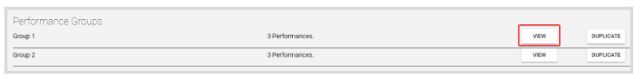
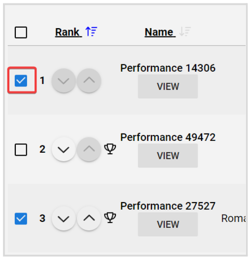
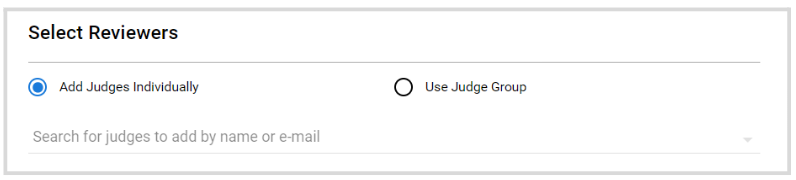
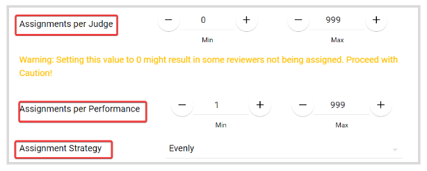
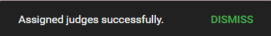
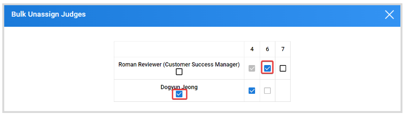

import React from 'react';
import { shareArticle } from '../../share.js';
import { FaLink } from 'react-icons/fa';
import { ToastContainer, toast } from 'react-toastify';
import 'react-toastify/dist/ReactToastify.css';

export const ClickableTitle = ({ children }) => (
    <h1 style={{ display: 'flex', alignItems: 'center', cursor: 'pointer' }} onClick={() => shareArticle()}>
        {children} 
        <FaLink size="0.6em" />
    </h1>
);

<ToastContainer />

<ClickableTitle>Bulk Assign/Unassigned Judges</ClickableTitle>

1. From the Home page, click **Competitions**  
2. Select the desired competition, and click **View**  
3. From the **Performances** tab, locate the **Performance Group** and click **View**

****

**Note:** if the Competition has Performance Groups disabled, you will be routed directly to the performances' list.

4. Click the **checkbox** to select some or all performances

5. Once selected, the **Bulk Action** button will be enabled. From the pop-up window, you can select **Assign Reviewers/Judges** or **Unassign Reviewers/Judges**

# **Assign Judges**

1. First, select judges. You can assign them **Individually** or use a **Group** including all selected judged

  
2. In the **Assignment Rules** section, you can select any of the following options:

* Each performance is reviewed by EVERY judge
* Each performance is reviewed by ONE judge
* Custom. You can personalize your assignment by setting a min-max number of assignments per **Judge** and **Performance**. And decide how the assignment strategy will be applied, between **Evenly**, **Random,** or **Least Queue**

****

3. If desired, click the checkbox to select **Ignore existing judge-assignments**. When computing the assignments to be made, the rules configured above can either be applied ignoring any previous assignments, or the rules can incorporate those existing assignments on the submissions selected.

4. Click **Assign**

****

5. You will receive the following confirmation message

# **Unassigned Judges**

1. From the unassign Judge window, judges are displayed as rows and performances as columns. Click to check the box under the judge name to select all performances, or check the box of each performance you would like to unassign 

2. Click **Unassign** 

