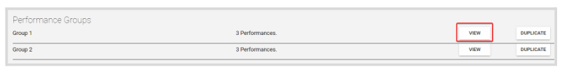
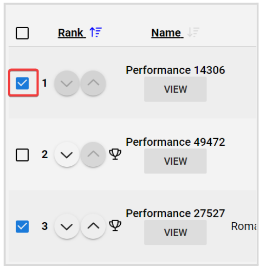
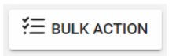
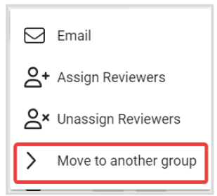
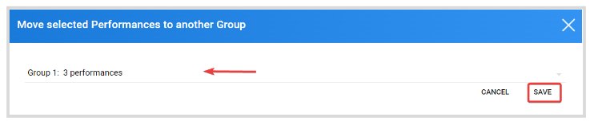

import { shareArticle } from '../../../components/share.js';
import { FaLink } from 'react-icons/fa';
import { ToastContainer, toast } from 'react-toastify';
import 'react-toastify/dist/ReactToastify.css';

export const ClickableTitle = ({ children }) => (
    <h1 style={{ display: 'flex', alignItems: 'center', cursor: 'pointer' }} onClick={() => shareArticle()}>
        {children} 
        <FaLink size="0.6em" />
    </h1>
);

<ToastContainer />

<ClickableTitle>Bulk Move Performances to Another Group</ClickableTitle>

1. From the Home page, click **Competitions**  
2. Select the desired competition, and click **View**  
3. From the **Performances** tab, locate the **Performance Group** and click **View**

******Note:** if the Competition has Performance Groups disabled, you will be routed directly to the performances' list.

4. Click the **checkbox** next to each performance to select some or all performances

  
5. Once selected the **Bulk Action** button will be enabled, click it and select **Move to Another Group**

6. Select the desired group from the drop-down menu, and click **Save**. 

