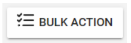

import React from 'react';
import { shareArticle } from '../../share.js';
import { FaLink } from 'react-icons/fa';
import { ToastContainer, toast } from 'react-toastify';
import 'react-toastify/dist/ReactToastify.css';

export const ClickableTitle = ({ children }) => (
    <h1 style={{ display: 'flex', alignItems: 'center', cursor: 'pointer' }} onClick={() => shareArticle()}>
        {children} 
        <FaLink size="0.6em" />
    </h1>
);

<ToastContainer />

<ClickableTitle>Bulk email to Participants</ClickableTitle>

1. From the Home page, click **Competitions**   
2. Select the desired competition, and click **View**   
3. From the **Performances** tab, locate the **Performance Group** to communicate to and click **View**

******Note:** if the Competition has Performance Groups disabled, you will be routed directly to the performances' list.

4. Click the **checkbox** to select some or all Participants 

5. Once selected the **Bulk Action** button  will be enabled, click it and select **Email** from the list 

6. From the Send E-mail window, first select the **Recipient(s)** to be **Applicants only** or **All Participants**  
7. Type a **Subject** and the **Body** of the message. Type @ to use a placeholder, and click or press TAB to confirm

  
8. Optional. By default, **Send me a Copy** is selected, you can remove it if you don't want to receive a copy of the message  
9. Click **Send**

****

10. You will receive the following confirmation message

