import React from 'react';
import { shareArticle } from '../../share.js';
import { FaLink } from 'react-icons/fa';
import { ToastContainer, toast } from 'react-toastify';
import 'react-toastify/dist/ReactToastify.css';

export const ClickableTitle = ({ children }) => (
    <h1 style={{ display: 'flex', alignItems: 'center', cursor: 'pointer' }} onClick={() => shareArticle()}>
        {children} 
        <FaLink size="0.6em" />
    </h1>
);

<ToastContainer />

<ClickableTitle>Create a Competition</ClickableTitle>

1. From the Home Page, click **Competitions**  
2. Click **+ Create Competition**

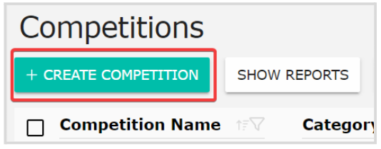   
3. Click **Settings** from the top bar. From here, you can set up the following:

## **General**

To start editing, click the **Edit** button from the General section

**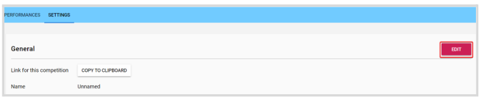**

1. **Link for this competition:** generate the public link for the competition  
2. **Name and Description:** set a title/name for the competition and describe guidelines, requirements, or any important details to display for applicants  
3. **Categorize:** you can select an existing category or subcategory to identify the competition, or create a new one by typing the name and clicking Create or pressing enter 

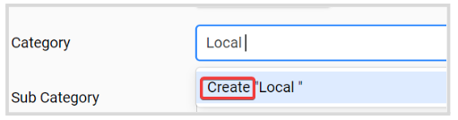  
4. **Group:** assign an existing group or create a new one to identify the competition  
5. **Tags:** assign an existing tag or create a new one to add a specific characteristic   
6. **Limited staff for this competition:** assign specific users to be part of the staff team   
7. **Admins only for this competition:** assign specific admins  
8. **Stage:** set stages that your competition will go through.   
**Note**: Only the first stage will be active to receive applications. To set a new stage, re-arrange it to be the first stage. 

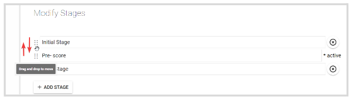

9. **Use Performance Group:** enable/disable the use of Performance Group by toggling ON/OFF  
10. **Score Display**: select how the score will display

* Default
* Merge current score with selected stage's avg score. Click **Configure** to specify stages to merge

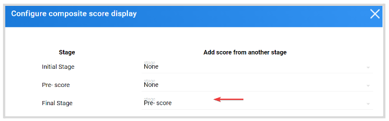

11. **Prizes:** add and personalize the competition prizes

## **Application**

To start editing, click the **Edit** button from the Application section

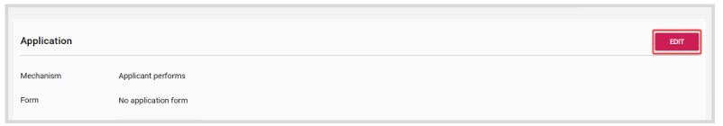

1. **Mechanism:** assign the application mechanism for the applicant. You can select from:

* Applicant performs
* Applicant registers a single performer
* Applicant registers multiple performers

2. **Form:** create the application form by clicking **Create Form**button

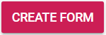

Enter the form name and add the necessary fields. Once ready, click **Save**

**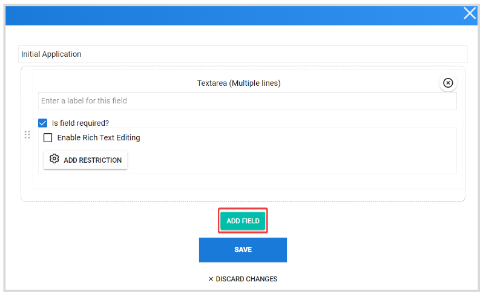**

You can find more information on the available form fields **[here](https://docs-for-customers.slayte.com/hc/en-us/articles/4412998428307-Form-Builder-Field-Options)**

3. **Confirmation Message:** create a personalized message to be displayed on the confirmation pop-up window to the applicant once the application has been successfully submitted.    
4. **Application period:** set a start and an end date for the competition   
5. **Performance Group Assignment:** by default, is set to Evenly  
6. **Min and Max participants per application:** by default no limit is set, type the number or use (+/-) to set the desired number.  
7. **Restrictions:** By default, competition is set to **Anyone can Apply/ Participate**. If required, you can set **Application** or **Participant** restrictions. For example: "User must be member of group" and assign/create a user's group

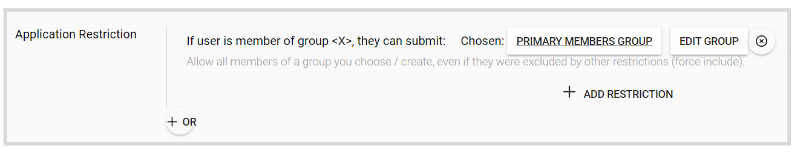

## **Notifications**

By default, these options are disabled. To enable them, simply click the checkbox to the left of each setting to be automatically saved.   
1. **E-mail blind-copy:** add a specific email address to blind/bcc-copy for any event happening in this competition. Separate by comes when adding multiple email addresses.  
2. **Communication:** a default automated message is set for all notification types. 

* Competition Application Received
* Competition Review Assigned
* Competition Review Received

However, you can personalize the message by creating a new template that can be used across competitions. 

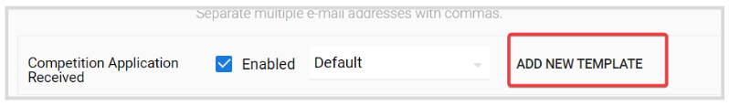

## **Performances Tab**

By default, the performance group is enabled. If not required, you can disable it from the **Settings** menu by following the steps above.

Only 1 Group is automatically created, you can create more by clicking the **Add button**

**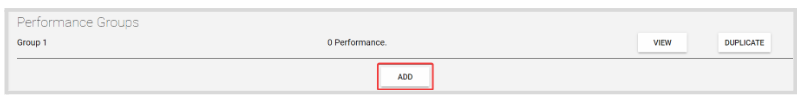**

Or **Duplicate**, to create a new one with the exact same configuration

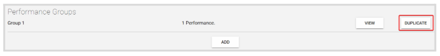

Click **View** to the right, then **Settings** to personalize the initial setup

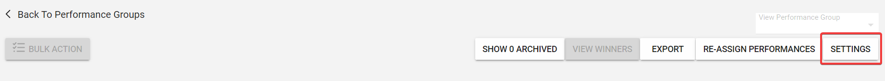  
To start updating these settings, click **Edit** on the right side

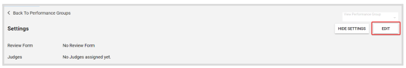

From here, you can set up the following: 

1. **Review Form:** create the review form by clicking **Create A Review** **Form** button. From the pop-up window, you can name the form and start adding the necessary fields. 

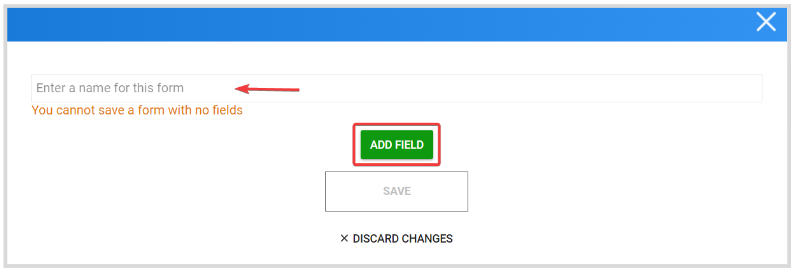

2. **Judges:** assign judges individually or by group, and select the assignment rules to apply: 

* Each performance is reviewed by EVERY judge
* Each performance is reviewed by ONE judge
* Custom, where you can customize the assignment based on your preferences

3. **Date Scheduling (Begin/End) and location:** add a new schedule (date and time) and location that will take place. 

4. Additionally, set **Granularity, Block Length,** and **Break Duration** by typing the number or using (+/-) to set the desired number.

4. Click **Save**

