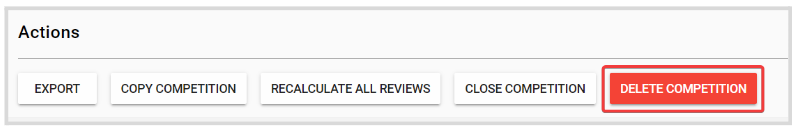
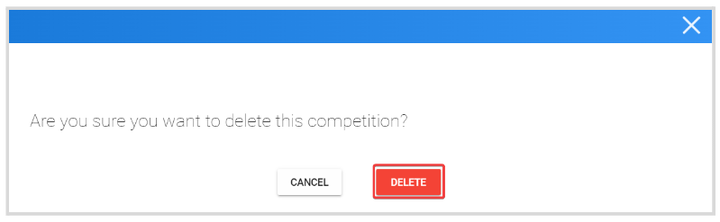

import { shareArticle } from '../../../components/share.js';
import { FaLink } from 'react-icons/fa';
import { ToastContainer, toast } from 'react-toastify';
import 'react-toastify/dist/ReactToastify.css';

export const ClickableTitle = ({ children }) => (
    <h1 style={{ display: 'flex', alignItems: 'center', cursor: 'pointer' }} onClick={() => shareArticle()}>
        {children} 
        <FaLink size="0.6em" />
    </h1>
);

<ToastContainer />

<ClickableTitle>Delete a Competition</ClickableTitle>

1. From the Home Page, go to **Competitions** and click **View** on the desired **Competition**  
2. Click the **Settings** tab from the top bar

  
3. Scroll down to the **Actions** section, and click **Delete Competition**

****

4. From the pop-up window, click **Delete** 

**Note:** this change is effective immediately, and cannot be undone. 

