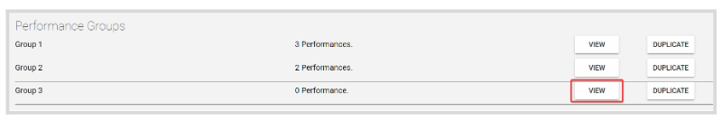

import React from 'react';
import { shareArticle } from '../../share.js';
import { FaLink } from 'react-icons/fa';
import { ToastContainer, toast } from 'react-toastify';
import 'react-toastify/dist/ReactToastify.css';

export const ClickableTitle = ({ children }) => (
    <h1 style={{ display: 'flex', alignItems: 'center', cursor: 'pointer' }} onClick={() => shareArticle()}>
        {children} 
        <FaLink size="0.6em" />
    </h1>
);

<ToastContainer />

<ClickableTitle>Delete a Performance Group</ClickableTitle>

1. Go to **Competitions**, and click the desired **Competition**

2. From the **Performances Tab**, locate the Group to delete and click **View**

   
3. Click **Settings**

   
4. Scroll down to the **Delete this performance group** section, and click **Delete Performance Group**

****

5. From the pop-up confirmation window, click **Delete** 

**Note:** Any performances under the group, will be automatically allocated to the prior group from the list and won't be deleted along with the group. You can then move these performances as needed by following the steps listed here 

