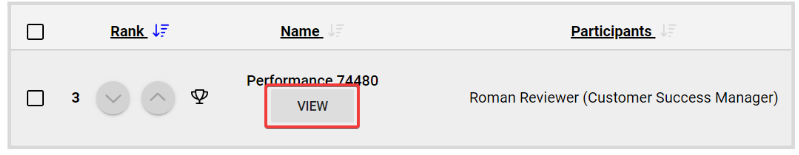
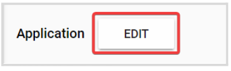
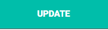
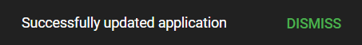

import React from 'react';
import { shareArticle } from '../../share.js';
import { FaLink } from 'react-icons/fa';
import { ToastContainer, toast } from 'react-toastify';
import 'react-toastify/dist/ReactToastify.css';

export const ClickableTitle = ({ children }) => (
    <h1 style={{ display: 'flex', alignItems: 'center', cursor: 'pointer' }} onClick={() => shareArticle()}>
        {children} 
        <FaLink size="0.6em" />
    </h1>
);

<ToastContainer />

<ClickableTitle>Edit a Performance Application</ClickableTitle>

1. Go to **Competitions**, click **View** for the desired Competition  
2. On the **Performances** Tab, locate the Group holding the performance and click **View**. In case of Performances Group is disabled, you will be displayed the list of performances instead.  
3. From the performance list, click **View** to the performance to update

4. In the **Application** **section**, click the **Edit** button

5. Update all applicable fields, then click **Preview** at the bottom for a preview of the changes

6. When ready, click **Update**

7. You will be routed to the performance details page, and get the following confirmation message 

