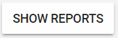
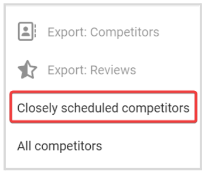
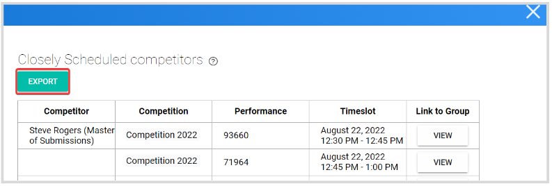
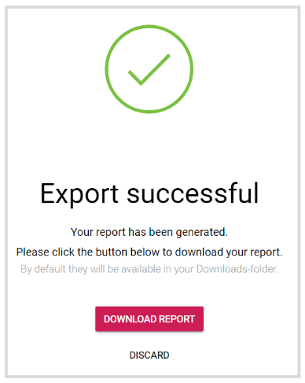

import React from 'react';
import { shareArticle } from '../../share.js';
import { FaLink } from 'react-icons/fa';
import { ToastContainer, toast } from 'react-toastify';
import 'react-toastify/dist/ReactToastify.css';

export const ClickableTitle = ({ children }) => (
    <h1 style={{ display: 'flex', alignItems: 'center', cursor: 'pointer' }} onClick={() => shareArticle()}>
        {children} 
        <FaLink size="0.6em" />
    </h1>
);

<ToastContainer />

<ClickableTitle>Export Closely Scheduled Competitors</ClickableTitle>

This is a list of all competitors across all non-closed competitions whose assigned performance time slot has a difference to another performance time slot of its duration or less.

1. From the Home page, go to **Competitions**. 

2. Select one or as many competitions as you desire  

3. Click **Show Reports**

****

4. From the pop-up menu, select **Closely Schedule Competitors**

5. In the pop-up window, you will have a preview of the list which will include the Competitor's name, Competition Name, Performance Timeslot, and a Link to Group. From here click **Export**

****

6. You will receive the following confirmation message, from here click **Download Report**

