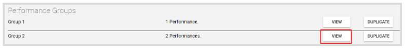
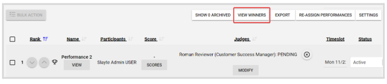
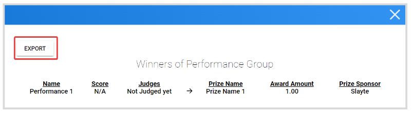
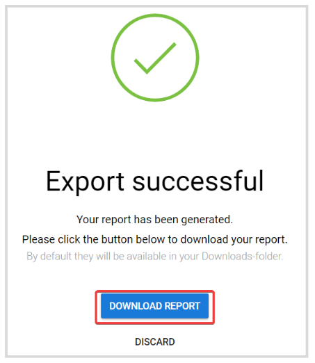

import React from 'react';
import { shareArticle } from '../../share.js';
import { FaLink } from 'react-icons/fa';
import { ToastContainer, toast } from 'react-toastify';
import 'react-toastify/dist/ReactToastify.css';

export const ClickableTitle = ({ children }) => (
    <h1 style={{ display: 'flex', alignItems: 'center', cursor: 'pointer' }} onClick={() => shareArticle()}>
        {children} 
        <FaLink size="0.6em" />
    </h1>
);

<ToastContainer />

<ClickableTitle>Export Competition Winners</ClickableTitle>

1. From the Home Page, go to **Competitions** and click **View** on the desired **Competition**  
2. Click the **Performances** tab, when Performances Groups is enabled; click **View** next to the desired group.

3. Click **View Winners** 

4. On the preview pop-up window, click **Export**

5. From the confirmation window, click **Export Report**

