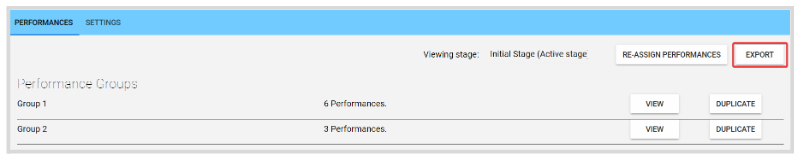
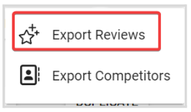
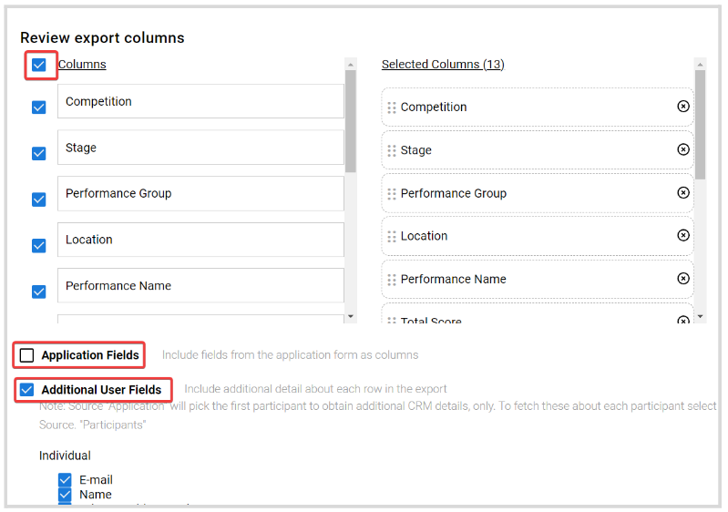
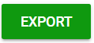
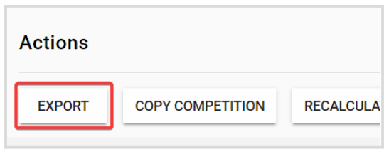
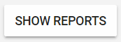
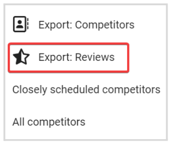
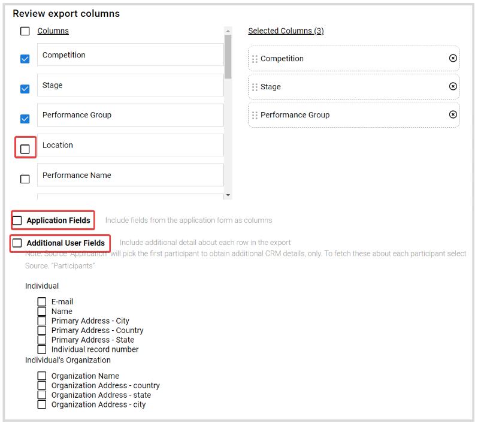

import React from 'react';
import { shareArticle } from '../../share.js';
import { FaLink } from 'react-icons/fa';
import { ToastContainer, toast } from 'react-toastify';
import 'react-toastify/dist/ReactToastify.css';

export const ClickableTitle = ({ children }) => (
    <h1 style={{ display: 'flex', alignItems: 'center', cursor: 'pointer' }} onClick={() => shareArticle()}>
        {children} 
        <FaLink size="0.6em" />
    </h1>
);

<ToastContainer />

<ClickableTitle>Export Competitions Reviews</ClickableTitle>

# **Single Competition**

1. Go to **Competitions**, and click **View** on the desired **Competition** 

2. From the **Performances** Tab, click **Export**

****

3. Select **Export Reviews** 

****

4. You can customize your export first by selecting **Review Export Columns** by clicking the **checkbox** next to the desired criteria. You can also select the **Application Fields** to be included and any **Additional User Fields**

5. Click **Export**when ready. You will receive an email with a CSV file attached with the selected data. 

You can also initiate an **Export**, from the Competitions **Settings** Tab. From here, scroll down to the **Actions** section and click **Export**

# **Multiple Competitions**

1. From the Home page, go to **Competitions**. 

2. Select one or as many competitions as you desire  

3. Click **Show Reports**

****

4. From the pop-up menu, select **Export: Reviews**

****

5. You can customize your export first by selecting **Review Export Columns** by clicking the **checkbox** next to the desired criteria. You can also select the **Application Fields** to be included and any **Additional User Fields**

6. Click **Export**when ready. You will receive an email with a CSV file attached with the selected data

