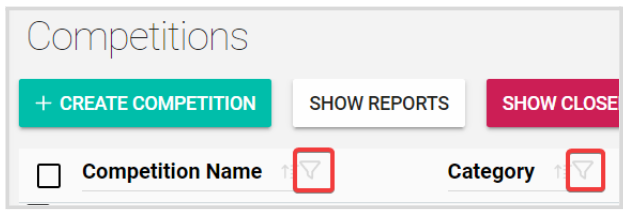
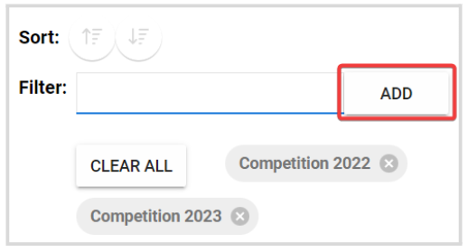
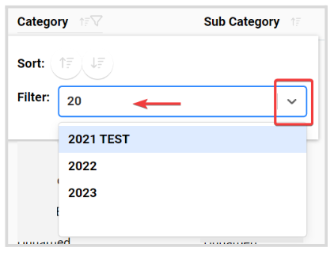
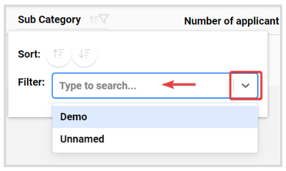
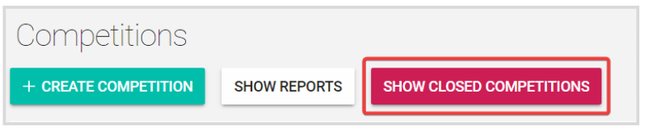
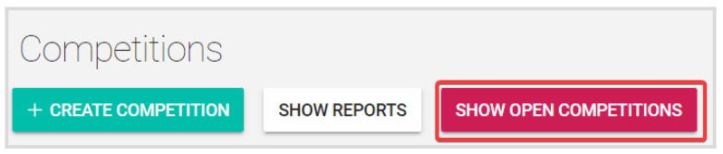

import React from 'react';
import { shareArticle } from '../../share.js';
import { FaLink } from 'react-icons/fa';
import { ToastContainer, toast } from 'react-toastify';
import 'react-toastify/dist/ReactToastify.css';

export const ClickableTitle = ({ children }) => (
    <h1 style={{ display: 'flex', alignItems: 'center', cursor: 'pointer' }} onClick={() => shareArticle()}>
        {children} 
        <FaLink size="0.6em" />
    </h1>
);

<ToastContainer />

<ClickableTitle>Filter Competitions</ClickableTitle>

You can easily locate **Competitions** by adding filters from the competitions list page. You can filter them by **Competition Name** or **Category + Subcategory.**

To the right of each column, click the **filter button** to open the filter window

To filter by **name**, enter the competition name and click **Add.**You can add multiple names for all related competitions to display on the list. 

To filter by a **category**, type the category name or click the down arrow to select from the drop-down menu. You can select as many as categories you want. 

Once you have selected a category, the **Sub Category** filter will be enabled. You can also type the name to search or select from the drop-down menu

## **Closed Competitions**

By default, the competitions list is set to display **Open competitions**, however, you can always re-visit **closed competitions** and filter the view by clicking the **Show Closed Competitions** button

From the Closed Competitions view, you'll also have the option to filter by **Competition Name** or **Category + Subcategory.** To go back to the open competitions, click the **Show Open Competitions** button

