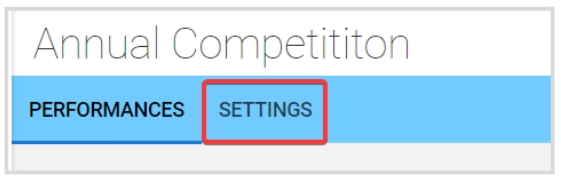
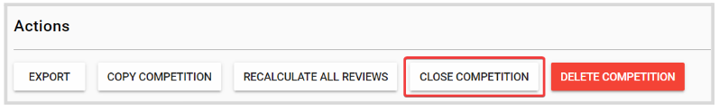
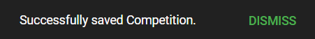
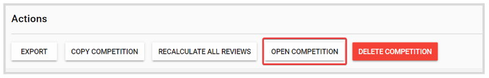

import React from 'react';
import { shareArticle } from '../../share.js';
import { FaLink } from 'react-icons/fa';
import { ToastContainer, toast } from 'react-toastify';
import 'react-toastify/dist/ReactToastify.css';

export const ClickableTitle = ({ children }) => (
    <h1 style={{ display: 'flex', alignItems: 'center', cursor: 'pointer' }} onClick={() => shareArticle()}>
        {children} 
        <FaLink size="0.6em" />
    </h1>
);

<ToastContainer />

<ClickableTitle>How to Close a Competition</ClickableTitle>

As an Administrator, you can set a Competition to **Close** to stop receiving applications. 

1. From the Home Page, go to **Competitions** and click **View** on the desired **Competition**  
2. Click the **Settings** tab from the top bar

  
3. Scroll down to the **Actions** section, and click **Close Competition**

****

4. You will receive the following confirmation message on the top

If due to a change of plans, you are required to re- Open the completion again. Go back to the Actions section and click Open Competition 

