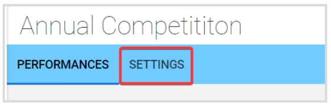
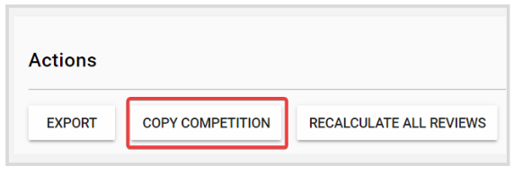
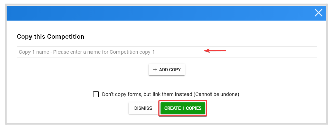
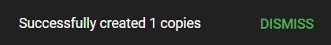

import { shareArticle } from '../../../components/share.js';
import { FaLink } from 'react-icons/fa';
import { ToastContainer, toast } from 'react-toastify';
import 'react-toastify/dist/ReactToastify.css';

export const ClickableTitle = ({ children }) => (
    <h1 style={{ display: 'flex', alignItems: 'center', cursor: 'pointer' }} onClick={() => shareArticle()}>
        {children} 
        <FaLink size="0.6em" />
    </h1>
);

<ToastContainer />

<ClickableTitle>How to Copy a Competition</ClickableTitle>

1. From the Home Page, go to **Competitions** and click **View** on the desired **Competition**   
2. Click the **Settings** tab from the top bar

   
3. Scroll down to the **Actions** section, and click **Copy Competition**

  
4. Enter the **name** of the competition copy, then click **Create # Copies**

**Note:** You can create multiple copies at once by clicking **+ Add Copy** 

5. You will receive the following confirmation message

