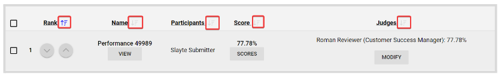

import { shareArticle } from '../../../components/share.js';
import { FaLink } from 'react-icons/fa';
import { ToastContainer, toast } from 'react-toastify';
import 'react-toastify/dist/ReactToastify.css';

export const ClickableTitle = ({ children }) => (
    <h1 style={{ display: 'flex', alignItems: 'center', cursor: 'pointer' }} onClick={() => shareArticle()}>
        {children} 
        <FaLink size="0.6em" />
    </h1>
);

<ToastContainer />

<ClickableTitle>How to Sort Performances</ClickableTitle>

From within a Performance Group, you can quickly sort them by **Rank**, **Name**, and **Participants** ascendant descendant or vice versa.

1. Go to the desired **Competition**, and click **View**   
2. In the **Performances tab**, click **View** next to the group holding the performances   
3. Click the **sort icon** next to each column's name

