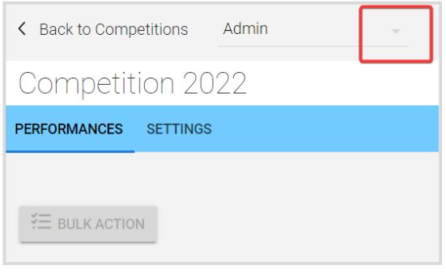
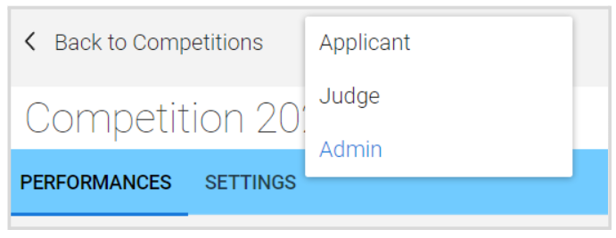
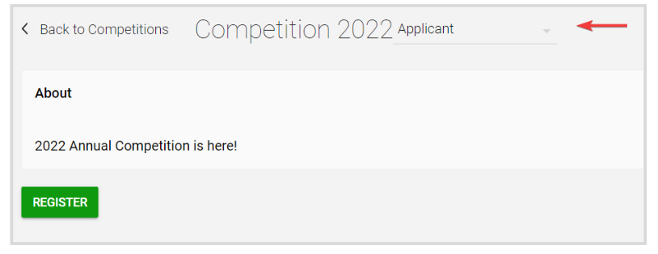

import React from 'react';
import { shareArticle } from '../../share.js';
import { FaLink } from 'react-icons/fa';
import { ToastContainer, toast } from 'react-toastify';
import 'react-toastify/dist/ReactToastify.css';

export const ClickableTitle = ({ children }) => (
    <h1 style={{ display: 'flex', alignItems: 'center', cursor: 'pointer' }} onClick={() => shareArticle()}>
        {children} 
        <FaLink size="0.6em" />
    </h1>
);

<ToastContainer />

<ClickableTitle>How to Switch Between Competition Views: Admin, Judge, Applicant</ClickableTitle>

As an Administrator, you have an Admin view by default. However, if you are also an Applicant or part of the Judges' team; you can switch between these roles or views to perform the different tasks.

1. From the main Competition list page, select the desired competition by clicking **View**

2. On top of the competition's name, **click the down arrow** next to the current view to display the available view's list

3. **Select the desired view** from the drop-down menu 

You can switch back to Admin or any other by selecting again from the view's drop-down menu

