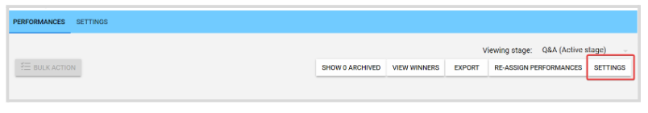
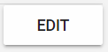
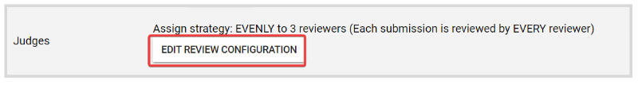
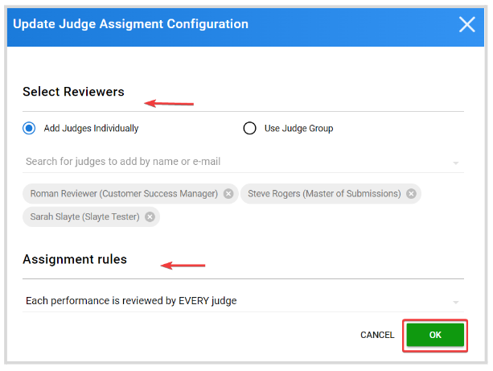
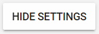
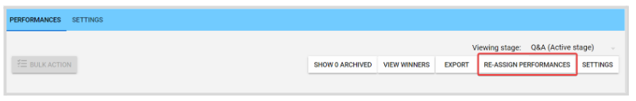
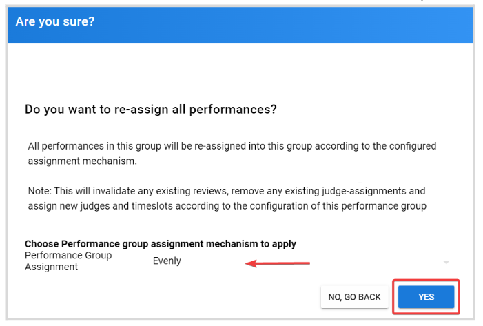
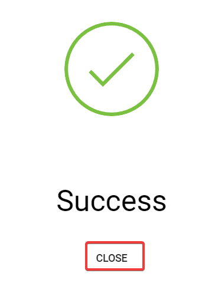

import { shareArticle } from '../../../components/share.js';
import { FaLink } from 'react-icons/fa';
import { ToastContainer, toast } from 'react-toastify';
import 'react-toastify/dist/ReactToastify.css';

export const ClickableTitle = ({ children }) => (
    <h1 style={{ display: 'flex', alignItems: 'center', cursor: 'pointer' }} onClick={() => shareArticle()}>
        {children} 
        <FaLink size="0.6em" />
    </h1>
);

<ToastContainer />

<ClickableTitle>Re-assign Performances</ClickableTitle>

As an Administrator, you can Reset/Reassign in bulk all performances to the configured assignment mechanism, in case there have been manual assignments that are no longer needed, judge changes, etc

You can confirm or update the review configuration prior to proceeding with the reassignment, by following these steps:

1. From the **Performances Tab**, click **Settings**

  
2. Click **Edit**on the right-top corner 

3. In the **Judges** section, click **Edit Review Configuration**

   
4. You can confirm or adjust the assignment as required, either by changing the **Judges** or the **Assignment Rules**. Once done, click **OK**

5. Click **Save**  
6. Click **Hide Settings** to go back to the Performances List page

Once you agreed with the assignment configuration, to continue click **Reassign Performances**

****

From the confirmation window, **Choose Performance group assignment mechanism to apply** and click **Yes** to continue

**/*/*Note:** This will invalidate any existing reviews, remove any existing judge-assignments and assign new judges and time slots according to the configuration of this performance group

Once successfully completed, you will receive the following confirmation message, click **Close**

