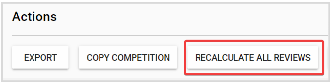
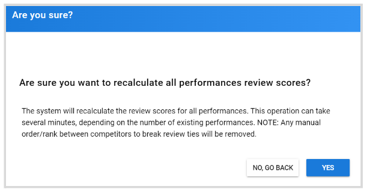

import React from 'react';
import { shareArticle } from '../../share.js';
import { FaLink } from 'react-icons/fa';
import { ToastContainer, toast } from 'react-toastify';
import 'react-toastify/dist/ReactToastify.css';

export const ClickableTitle = ({ children }) => (
    <h1 style={{ display: 'flex', alignItems: 'center', cursor: 'pointer' }} onClick={() => shareArticle()}>
        {children} 
        <FaLink size="0.6em" />
    </h1>
);

<ToastContainer />

<ClickableTitle>Recalculate Reviews</ClickableTitle>

When on an ongoing competition or when reviews have already been submitted, you decide to update the score configuration; you can re-calculate any values already received to match the said configuration

1. From the desire **Competition**, go to the **Settings** tab from the top bar  
2. Scroll down to the **Actions** section, and click **Recalculate All Reviews**

****

3. From the confirmation window, click **Yes**

**NOTE:** Any manual order/rank between competitors to break review ties will be removed

