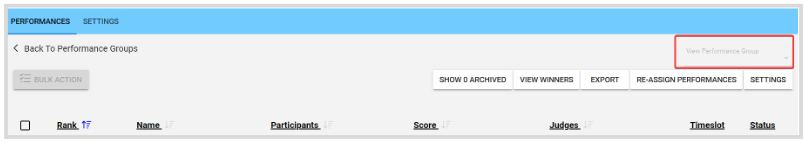
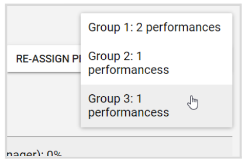

import React from 'react';
import { shareArticle } from '../../share.js';
import { FaLink } from 'react-icons/fa';
import { ToastContainer, toast } from 'react-toastify';
import 'react-toastify/dist/ReactToastify.css';

export const ClickableTitle = ({ children }) => (
    <h1 style={{ display: 'flex', alignItems: 'center', cursor: 'pointer' }} onClick={() => shareArticle()}>
        {children} 
        <FaLink size="0.6em" />
    </h1>
);

<ToastContainer />

<ClickableTitle>Switch Between Performances Groups</ClickableTitle>

You can easily move between groups, from within each group's details page, instead of returning to the Group's list page every time.

1. Go to the desired **Competition**, and click on the Performances Tab.   
2. From the **Performances Groups** list, click **View** to any of the groups   
3. From within the Group's details page, click the drop-down menu from the right top corner

4. Select the group you would like to switch to from the available list 

**Note:** Performances Groups need to be enabled via the **Competition settings** for this function to be available.

