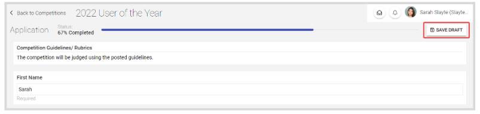
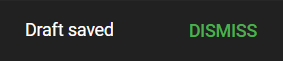
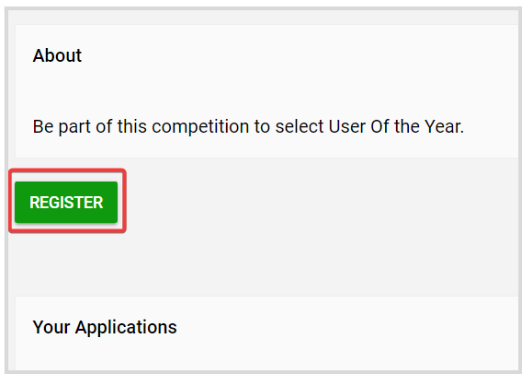

import { shareArticle } from '../../../components/share.js';
import { FaLink } from 'react-icons/fa';
import { ToastContainer, toast } from 'react-toastify';
import 'react-toastify/dist/ReactToastify.css';

export const ClickableTitle = ({ children }) => (
    <h1 style={{ display: 'flex', alignItems: 'center', cursor: 'pointer' }} onClick={() => shareArticle()}>
        {children} 
        <FaLink size="0.6em" />
    </h1>
);

<ToastContainer />

<ClickableTitle>How to Save an Application Draft</ClickableTitle>

While registering an application, you can save a Draft with the progress to continue with registration at a later time from where you left off, by clicking the **Save Draft** button on the right top corner, of the Application page.

Once saved, you will receive the following confirmation message at the top of the screen. Then you can leave the page.

When you are ready to complete the application, from the application main page click **Register** to be taken to the previously saved draft

