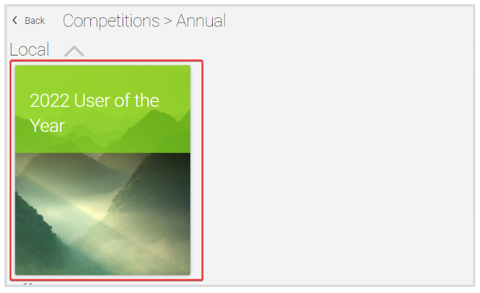

import React from 'react';
import { shareArticle } from '../../share.js';
import { FaLink } from 'react-icons/fa';
import { ToastContainer, toast } from 'react-toastify';
import 'react-toastify/dist/ReactToastify.css';

export const ClickableTitle = ({ children }) => (
    <h1 style={{ display: 'flex', alignItems: 'center', cursor: 'pointer' }} onClick={() => shareArticle()}>
        {children} 
        <FaLink size="0.6em" />
    </h1>
);

<ToastContainer />

<ClickableTitle>Register an Application</ClickableTitle>

1. From the Home page, click **Competitions** from the left panel or the **Competition tile**

2. Click the **Category** **tile** the desired competition is under

3. You will be presented with the available competition under the selected category, click the **competition tile**

4. Click **Register**

   
5. Fill in all the required fields, and click **Preview** when ready

6. A Preview of the application will be displayed, click **Register** to continue

7. You will receive the following confirmation

