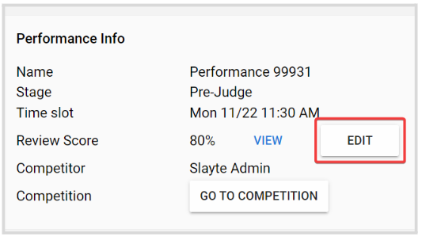

import { shareArticle } from '../../../components/share.js';
import { FaLink } from 'react-icons/fa';
import { ToastContainer, toast } from 'react-toastify';
import 'react-toastify/dist/ReactToastify.css';

export const ClickableTitle = ({ children }) => (
    <h1 style={{ display: 'flex', alignItems: 'center', cursor: 'pointer' }} onClick={() => shareArticle()}>
        {children} 
        <FaLink size="0.6em" />
    </h1>
);

<ToastContainer />

<ClickableTitle>How to Edit an Application Review</ClickableTitle>

1. From the Home page, click **Competitions** from the left panel or the **Competition tile**

2. Click the **Category** **tile** the desired competition is under

3. Click the competition tile holding the review 

4. In the **Review Performances** section, click View to the right of the Review you would like to edit 

5. Click **Edit**

6. Once you have completed the necessary changes, click **Preview**

7. A Preview of the review will be displayed, click **Submit** to continue

8. You will receive the following confirmation message 

