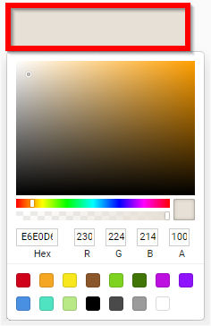

import { shareArticle } from '../../../components/share.js';
import { FaLink } from 'react-icons/fa';
import { ToastContainer, toast } from 'react-toastify';
import 'react-toastify/dist/ReactToastify.css';

export const ClickableTitle = ({ children }) => (
    <h1 style={{ display: 'flex', alignItems: 'center', cursor: 'pointer' }} onClick={() => shareArticle()}>
        {children} 
        <FaLink size="0.6em" />
    </h1>
);

<ToastContainer />

<ClickableTitle>Add Platform Branding</ClickableTitle>

1. From the Home page select **Events** from the tile or from the left pane

2. Select the desired event

3. Select **General** 

4. Scroll down to the **Platform branding** section 

5. Choose if using **header color** *or* **header image** by selecting bullet next to desired option

5a. If **Header color**, click in the box to select desired color 

5b. If **Header image**, drag and drop image to upload image bracket or click in field to open File Explorer

/*Please note, 1500px X 300px is recommended for best results.

6. Select **List** and **Logo** image(s) by dragging and dropping into image field or click in image field to open File Explorer to add image(s)

7. Select **Overview Page Style** Select an Overview Banner Image by dragging and dropping into image field or click in image field to open File Explorer to add image(s)

8. Select **SAVE** to complete changes

 

 

