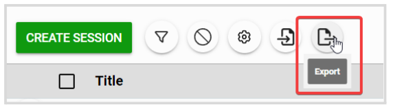
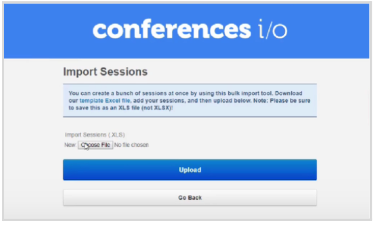
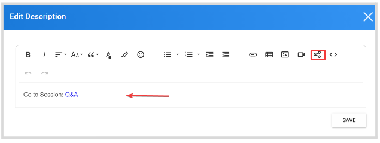
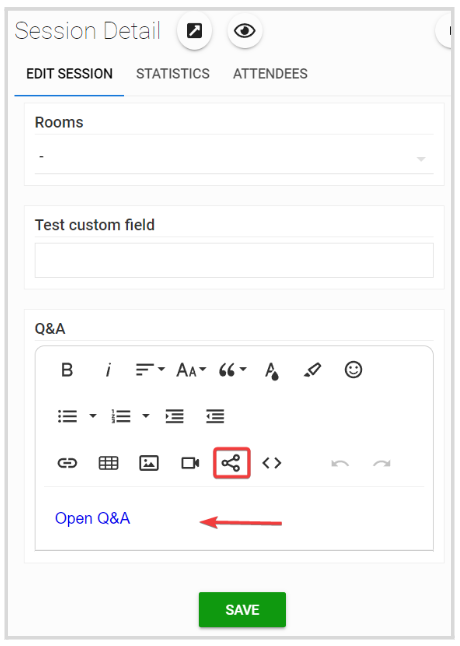

import React from 'react';
import { shareArticle } from '../../share.js';
import { FaLink } from 'react-icons/fa';
import { ToastContainer, toast } from 'react-toastify';
import 'react-toastify/dist/ReactToastify.css';

export const ClickableTitle = ({ children }) => (
    <h1 style={{ display: 'flex', alignItems: 'center', cursor: 'pointer' }} onClick={() => shareArticle()}>
        {children} 
        <FaLink size="0.6em" />
    </h1>
);

<ToastContainer />

<ClickableTitle>Add Polls and Q&A to your Event and Sessions</ClickableTitle>

In an existing Slayte event, with planned sessions; you can easily integrate conference.IO session direct access; whether you would like to display it as an event Page or from within a session.

1. From the Home Page, go to **Events** and locate the desired event   
2. From the left panel, click the **Sessions** tab. You will be required to export your sessions' data where you can include; but are not limited to start/end date, title, speakers, etc. Click the **Export** icon and select **Export Sessions to CSV**

3. From conferences.IO, go to the **Import Sessions** function to select the previously exported CSV file and click **Upload**. This will import all sessions to have the poll/ Q&A URL attached to the sessions when created

4. **Export** all sessions again, now including the session direct URL.

## **Event Page**

You can create a **custom Page** by following the steps [here](https://docs-for-customers.slayte.com/hc/en-us/articles/4494376846227), to include a session direct link

## **Session Details**

You can **embed** the Session Direct URL in the **Description**. Click **Edit** and select **Embed URL**

****

Or you can create a separate **custom field** in the session by following the steps [here](https://docs-for-customers.slayte.com/hc/en-us/articles/4413826527635); where you can use a Textarea type of field and enable Rich Text Editing to then **embed** the Session Direct URL 

