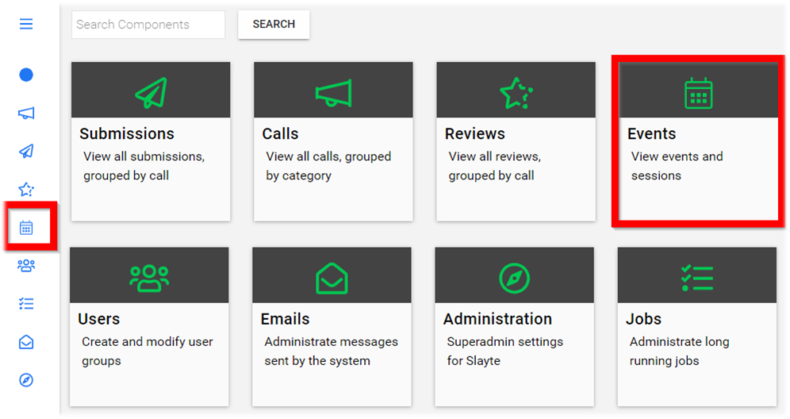

import React from 'react';
import { shareArticle } from '../../share.js';
import { FaLink } from 'react-icons/fa';
import { ToastContainer, toast } from 'react-toastify';
import 'react-toastify/dist/ReactToastify.css';

export const ClickableTitle = ({ children }) => (
    <h1 style={{ display: 'flex', alignItems: 'center', cursor: 'pointer' }} onClick={() => shareArticle()}>
        {children} 
        <FaLink size="0.6em" />
    </h1>
);

<ToastContainer />

<ClickableTitle>Add Support Email</ClickableTitle>

The **Support Email** is designed to send email notifications from Slayte to the Event Admin. Such emails include but not limited to audience unable to register.

1. From the Home page select **Events** from the tile or from the left pane

2. Select the *desired* event

3. Select **General** 

4. Scroll down to the **Support Email** field then enter internal support email address for any emails Slayte system sends to the administrator

5. Select **SAVE** to complete changes

