import React from 'react';
import { shareArticle } from '../../../components/share.js';
import { FaLink } from 'react-icons/fa';
import { ToastContainer, toast } from 'react-toastify';
import 'react-toastify/dist/ReactToastify.css';

export const ClickableTitle = ({ children }) => (
    <h1 style={{ display: 'flex', alignItems: 'center', cursor: 'pointer' }} onClick={() => shareArticle()}>
        {children} 
        <FaLink size="0.6em" />
    </h1>
);

<ToastContainer />

<ClickableTitle>Add a Virtual Component to a Session</ClickableTitle>

A virtual component is encouraged for a session for several reasons:

1. **Convenience**: Virtual sessions allow participants to join from any location with an internet connection, eliminating the need for travel.
2. **Cost-effectiveness**: Virtual sessions save on costs associated with travel, lodging, and meals for participants, as well as venue rental.
3. **Increased accessibility**: Virtual sessions make it easier for people with disabilities or those in remote locations to participate.
4. **Wider reach**: Virtual sessions have the potential to reach a larger audience as participants from all over the world can join.
5. **Time-saving**: Virtual sessions eliminate the need for participants to take time off work or travel to attend the session, saving them time and increasing productivity.

In summary, virtual components are encouraged for sessions as they offer convenience, cost-effectiveness, increased accessibility, wider reach, and time-saving benefits.

 

**Zoom (Integration Title)** - Allow the event admin to use Zoom's integration to create a new video conference or link an existing video conference. This integration allows the specified speaker to start the meeting as a host, please click [**here**](https://docs-for-customers.slayte.com/hc/en-us/articles/5098368701075-Assign-Your-Speaker-as-Zoom-Host) for more information. Please click [**here**](https://docs-for-customers.slayte.com/hc/en-us/articles/4412117300115-Zoom) for more information on the integration.

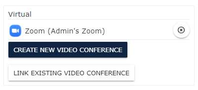

**Zoom (Generic)** - Generic is without integration but just as effective to insert the meeting room URL.

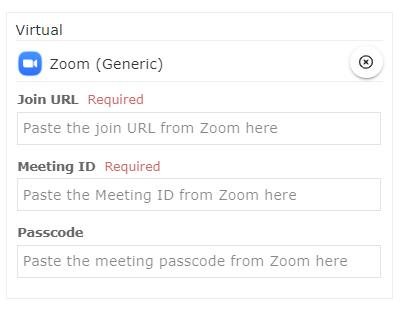

**GoToMeeting** - Please click [**here**](https://docs-for-customers.slayte.com/hc/en-us/articles/13507576503827-GoToMeeting) for more information on the integration.

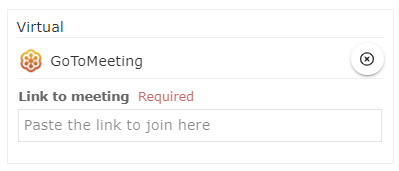

**Webex by Cisco** - Please click [**here**](https://docs-for-customers.slayte.com/hc/en-us/articles/13507572219795-Webex-by-Cisco) for more information on the integration.

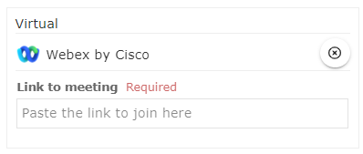

**Google Meet**

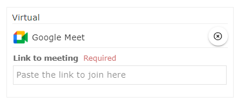

**Webcasts.com**

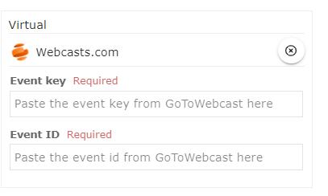

**Video Link (Youtube, Vimeo, Wistia & more)**

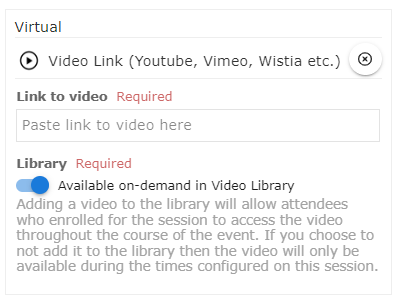

**RTMP Stream (HLS)**

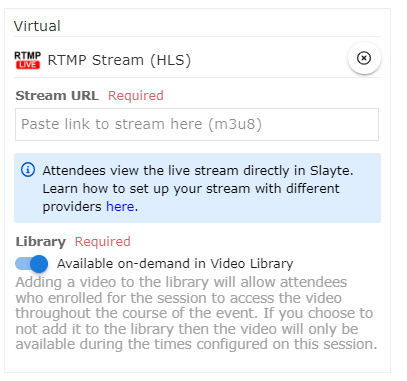

**YouTube Live**

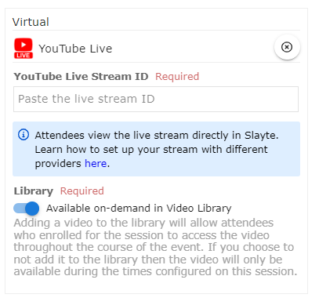

**Facebook Live**

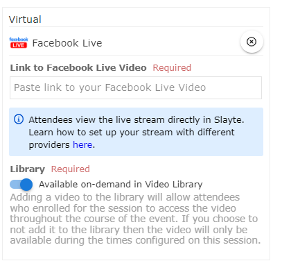

**Vimeo Live**

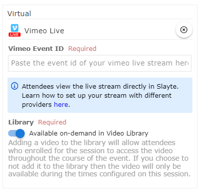

/_

