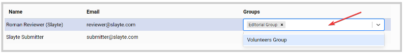

import React from 'react';
import { shareArticle } from '../../share.js';
import { FaLink } from 'react-icons/fa';
import { ToastContainer, toast } from 'react-toastify';
import 'react-toastify/dist/ReactToastify.css';

export const ClickableTitle = ({ children }) => (
    <h1 style={{ display: 'flex', alignItems: 'center', cursor: 'pointer' }} onClick={() => shareArticle()}>
        {children} 
        <FaLink size="0.6em" />
    </h1>
);

<ToastContainer />

<ClickableTitle>Assign/Remove Editors Group to a User</ClickableTitle>

Once you have created the Editors groups, you can start assigning them to the users. You can assign a group to a user when adding the user as stated [here](https://docs-for-customers.slayte.com/hc/en-us/articles/5763418956051-Editors-Groups) or from the main group list.

1. Go to **Events**, and click the desired event tile 

2. From the left panel, click **Editors**

## **Assign**

Under the **Groups column**, each user will have a drop-down menu for you to select the group you would like to **assign**. Click anywhere in the field and select the team from the list

## **Remove**

From the **Groups** field to the right, click the **X** next to each group's name you would like to remove for each user

 

