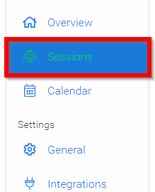
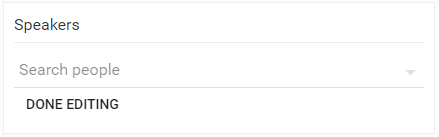
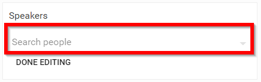
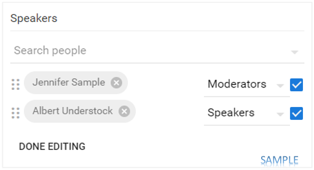

import React from 'react';
import { shareArticle } from '../../share.js';
import { FaLink } from 'react-icons/fa';
import { ToastContainer, toast } from 'react-toastify';
import 'react-toastify/dist/ReactToastify.css';

export const ClickableTitle = ({ children }) => (
    <h1 style={{ display: 'flex', alignItems: 'center', cursor: 'pointer' }} onClick={() => shareArticle()}>
        {children} 
        <FaLink size="0.6em" />
    </h1>
);

<ToastContainer />

<ClickableTitle>Assign Speaker to Session</ClickableTitle>

1. From the desired event navigate to **Sessions**

2. **Click** on the desired **session** to open the Session Detail

3. Scroll down to the **Speakers** section

4. **Click** on the "**Search people**" dropdown menu then start typing individual's name, once found select the desired individual's name 

5. Select the **speaker's role** from the previously created list

6. *Optional but recommended/*/**, select the checkbox to **[allow the selected speaker to modify the session](https://docs-for-customers.slayte.com/hc/en-us/articles/4455573445139-Defining-Conference-Speaker-Types-Roles)** see sample below:

Please note, you can select the 6 dots to **rearrange the order** of the speakers!!!

7. Select **SAVE** to complete changes

/*Please note, you are not limited to the numbers of "speakers and their roles in Slayte.

