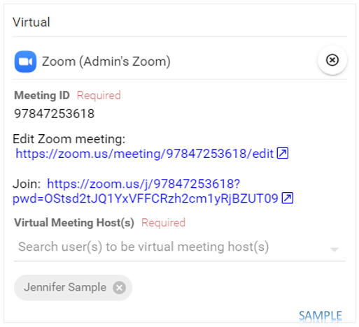

import { shareArticle } from '../../../components/share.js';
import { FaLink } from 'react-icons/fa';
import { ToastContainer, toast } from 'react-toastify';
import 'react-toastify/dist/ReactToastify.css';

export const ClickableTitle = ({ children }) => (
    <h1 style={{ display: 'flex', alignItems: 'center', cursor: 'pointer' }} onClick={() => shareArticle()}>
        {children} 
        <FaLink size="0.6em" />
    </h1>
);

<ToastContainer />

<ClickableTitle>Assign Your Speaker as Zoom Host</ClickableTitle>

Slayte is a [Zoom partner](https://marketplace.zoom.us/apps/iwf4y3oHRIm04kGmx1kWeg) and has the deepest integration with Zoom available on the market. As part of this integration, the software can join designated users as Zoom hosts, without the need for them to be on your Zoom license. This means that you can let your speakers run their own meetings, without the need for a Staff member to join every Zoom session. The speakers can start it themselves.

You can designate on each session which users are the "Virtual Meeting Host(s)" by following the steps below.

Please Note: We do require you to set up the Zoom integration as described [here](https://docs-for-customers.slayte.com/hc/en-us/articles/5098415157139-Zoom-Integration) to complete the below steps (reload the page if the "Virtual Meeting Host(s)" field is not visible after you installed the Zoom app).

 

1. From the desired event navigate to **Sessions**

2. **Click** on the desired **session** to open the Session Detail

3. Scroll down to the **Virtual** section of the session detail then select **ADD STREAM / VIDEO / CONFERENCE**

4. Select the desired installation label

5. Select **CREATE NEW VIDEO CONFERENCE**

6. Search for a user to be host in **Virtual Meeting Host(s)** section

7. Select **Save** to complete changes

Please ensure that you have assigned host as the session speaker, if needed.

Note, you can also click on the **Edit Zoom meeting** link to configure the zoom meeting room ie., mute participants when entering and more.

