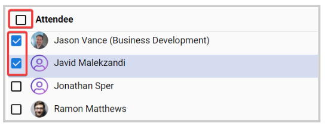
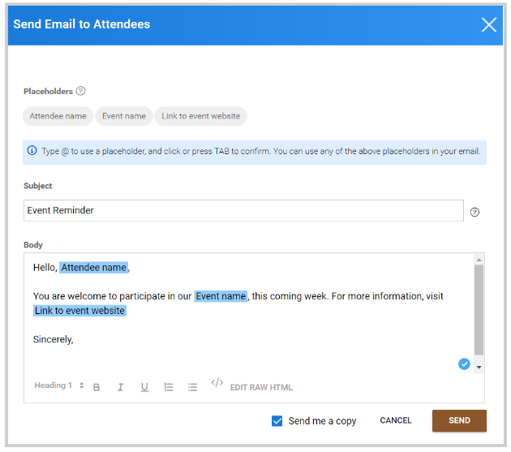

import React from 'react';
import { shareArticle } from '../../share.js';
import { FaLink } from 'react-icons/fa';
import { ToastContainer, toast } from 'react-toastify';
import 'react-toastify/dist/ReactToastify.css';

export const ClickableTitle = ({ children }) => (
    <h1 style={{ display: 'flex', alignItems: 'center', cursor: 'pointer' }} onClick={() => shareArticle()}>
        {children} 
        <FaLink size="0.6em" />
    </h1>
);

<ToastContainer />

<ClickableTitle>Bulk Email Attendees</ClickableTitle>

1. Go to **Events**, and select the desired event 

2. From the left panel, click **Attendees**

3. Select some or all attendees from the list you would like to send a message to, by checking the box next to the name or on the top to select all

4. Click the **Bulk Action** button, and select **Send E-Mail**

5. Write and personalize your message 

6. Click **Send**

