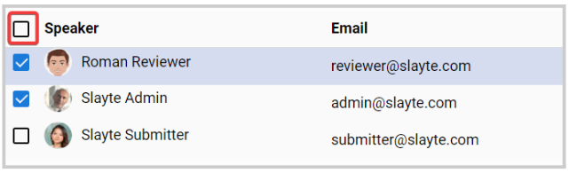
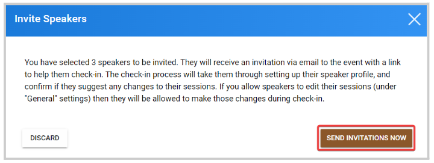

import { shareArticle } from '../../../components/share.js';
import { FaLink } from 'react-icons/fa';
import { ToastContainer, toast } from 'react-toastify';
import 'react-toastify/dist/ReactToastify.css';

export const ClickableTitle = ({ children }) => (
    <h1 style={{ display: 'flex', alignItems: 'center', cursor: 'pointer' }} onClick={() => shareArticle()}>
        {children} 
        <FaLink size="0.6em" />
    </h1>
);

<ToastContainer />

<ClickableTitle>Bulk Send Invitations to Speakers</ClickableTitle>

You can send at any time to the event speakers, an invitation via email which will include the direct link to the event to help them to complete the check-in, profile, and change their sessions in case this function has been enabled.

[Here](https://docs-for-customers.slayte.com/hc/en-us/articles/4494215100947) you can find more information on how to allow speakers to edit their sessions.

1. From the desired event, go to **Speakers**

2. Select from the list, the speakers that apply or all by checking the box next to **Speaker**

****

3. Once the speakers have been selected, the Bulk Action button will be enabled. Click **Bulk Action** and select **Send Invitation.**

4. From the pop-up window, click **Send Invitations Now** 

