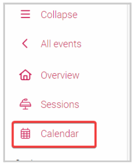

import React from 'react';
import { shareArticle } from '../../share.js';
import { FaLink } from 'react-icons/fa';
import { ToastContainer, toast } from 'react-toastify';
import 'react-toastify/dist/ReactToastify.css';

export const ClickableTitle = ({ children }) => (
    <h1 style={{ display: 'flex', alignItems: 'center', cursor: 'pointer' }} onClick={() => shareArticle()}>
        {children} 
        <FaLink size="0.6em" />
    </h1>
);

<ToastContainer />

<ClickableTitle>Calendar View</ClickableTitle>

The Calendar View provides a visual overview of scheduled sessions in your event. You can make changes to your scheduled sessions by dragging and dropping them to a different date and time slots. To make changes to your Event from the Sessions List View, you should refer to this [article](https://docs-for-customers.slayte.com/hc/en-us/articles/4714768527635-Edit-Session-Details).

1. From the desired event, click **Calendar**from the left panel 

2. You will be redirected to the event's session **calendar view**

3. Begin navigating the calendar view by **selecting the view**:

* Week - Will display a seven-day calendar
* 1 Day - Will display sessions in hours
* 3 Days - Will display a three-day calendar
* Swim lanes - Will display according to custom fields and categories

4. You can also personalize the Calendar view, by enabling the Hidden options at the bottom of the page; which include: 

* Filters
* Display
* Drop zone
* Unscheduled Appointments
* Detail

For more information on these functions, go [here](https://docs-for-customers.slayte.com/hc/en-us/articles/12772195106195)

