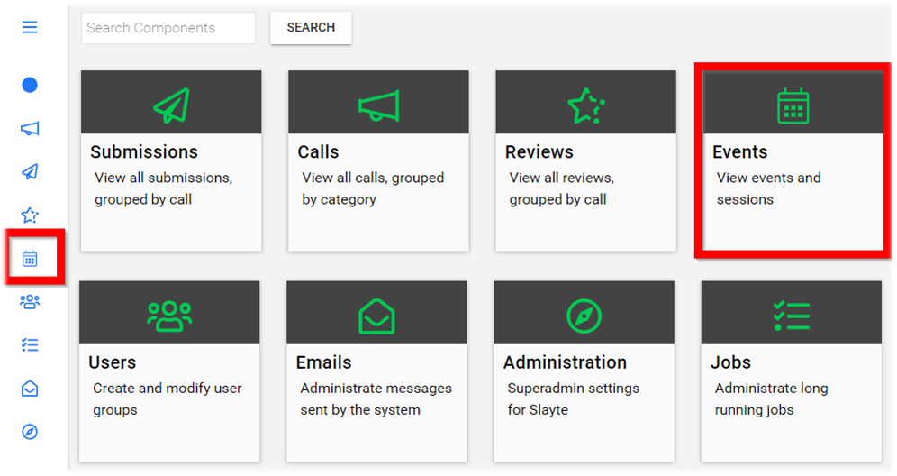
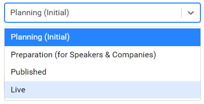
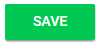

import { shareArticle } from '../../../components/share.js';
import { FaLink } from 'react-icons/fa';
import { ToastContainer, toast } from 'react-toastify';
import 'react-toastify/dist/ReactToastify.css';

export const ClickableTitle = ({ children }) => (
    <h1 style={{ display: 'flex', alignItems: 'center', cursor: 'pointer' }} onClick={() => shareArticle()}>
        {children} 
        <FaLink size="0.6em" />
    </h1>
);

<ToastContainer />

<ClickableTitle>Change Status</ClickableTitle>

1. From the Home page select **Events** from the tile or from the left pane

2. Select the desired event

3. Select **General** 

4. Scroll down to the Status section the default will be listed as Planning (Initial) then click in the field to change the **status**

**Planning (Initial)** Only Administrators can access event

**Preparation (for Speakers & Companies)** Only Administrators, Companies (exhibitor/sponsor) and Speakers that have been designated of sessions can access the event to modify their session/pages

**Published** Accessible with the link to ALL participants but cannot engage with each other

**Live** Accessible to ALL participants

5. Once status has been updated scroll down to select **SAVE**

