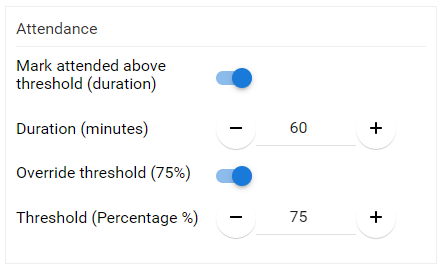
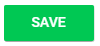

import { shareArticle } from '../../../components/share.js';
import { FaLink } from 'react-icons/fa';
import { ToastContainer, toast } from 'react-toastify';
import 'react-toastify/dist/ReactToastify.css';

export const ClickableTitle = ({ children }) => (
    <h1 style={{ display: 'flex', alignItems: 'center', cursor: 'pointer' }} onClick={() => shareArticle()}>
        {children} 
        <FaLink size="0.6em" />
    </h1>
);

<ToastContainer />

<ClickableTitle>Configure Attendance of Sessions - Optional</ClickableTitle>

It's possible to configure a duration of time for attendance tracking required by the attendee(s), in order for them to be marked as session attended. This is primarily useful when tracking attendance for Education Credit Claim when used with the Education Credit module.

1. From **Home** select the **Events** module

2. Navigate to the desired event and desired session

3. Under **Sessions** select the desired session then open the Session Detail to modify the attendance criteria

4. Under **Attendance** turn on **Mark attended above threshold (duration)**

* Enable the Mark attended above threshold duration by sliding the toggle to enabled
* Specify the number in minutes required for the attendee to be marked for the session as attended
* (Optional) **Override threshold (75%):** This is the default value assigned for attendance required to be marked as attended
	+ If enabled change the **Threshold (Percentage %):** Manually specify a percentage to mark as attended to the session

5. Select **SAVE** on the session detail when ready

