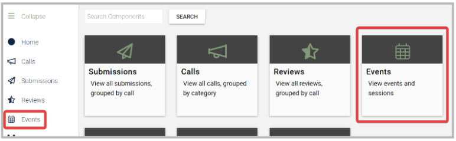
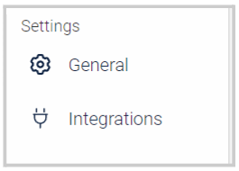
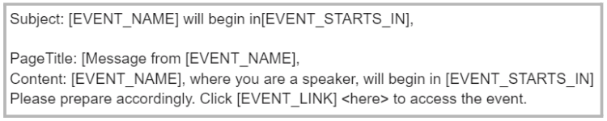
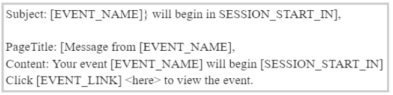
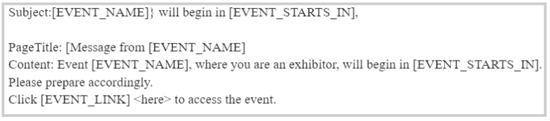
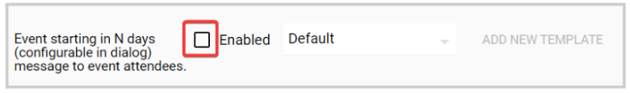
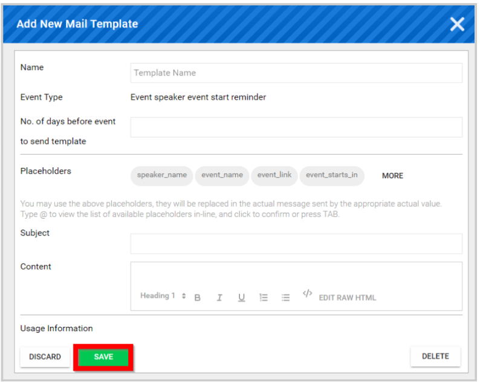

import React from 'react';
import { shareArticle } from '../../share.js';
import { FaLink } from 'react-icons/fa';
import { ToastContainer, toast } from 'react-toastify';
import 'react-toastify/dist/ReactToastify.css';

export const ClickableTitle = ({ children }) => (
    <h1 style={{ display: 'flex', alignItems: 'center', cursor: 'pointer' }} onClick={() => shareArticle()}>
        {children} 
        <FaLink size="0.6em" />
    </h1>
);

<ToastContainer />

<ClickableTitle>Configure Events Module Communications</ClickableTitle>

For each Event, you can set up automated notifications for all parties involved to remind them the event starts in a certain amount of days according to their role. You can follow these steps to enable or personalize these notifications: 

1. From the **Home** page, select **Events** from the tile or from the left panel****
2. **Select the event you want to set up, then under “Settings” click “**General**”: **
3. Under the ”**Event Communication**” section, you’ll have the option to set notifications for speakers, attendees, and exhibitors. Note, that the notifications are automatically enabled and set with the default email template. Find the email samples below:

**For Speaker:**

**For Attendee:**

**For Exhibitors:**

The default notifications are set to be sent 2 days prior to the event date, and cannot be modified. If you want to disable them instead, click the checkbox to remove the blue check: 

4. To customize the email template, select “**ADD NEW TEMPLATE**”. This needs to be done for each communication type.

5. In the pop-up window, you can start to edit/personalize the template as desired and click Save once done.

6. Once saved, the default email title will change to a new email template name with the creator's name.

7. Scroll down to the bottom of the page and click **SAVE** again to complete the changes. 

 

 

 

 

 

