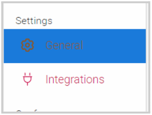
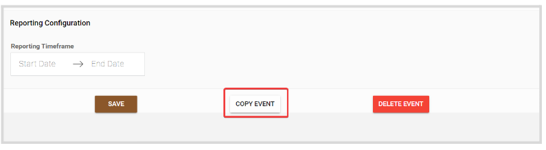
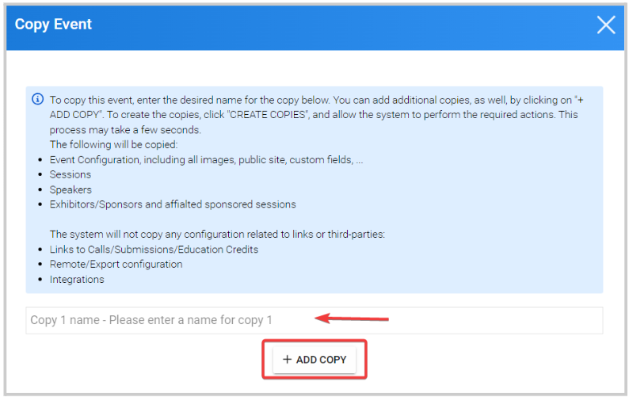
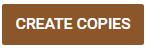

import React from 'react';
import { shareArticle } from '../../share.js';
import { FaLink } from 'react-icons/fa';
import { ToastContainer, toast } from 'react-toastify';
import 'react-toastify/dist/ReactToastify.css';

export const ClickableTitle = ({ children }) => (
    <h1 style={{ display: 'flex', alignItems: 'center', cursor: 'pointer' }} onClick={() => shareArticle()}>
        {children} 
        <FaLink size="0.6em" />
    </h1>
);

<ToastContainer />

<ClickableTitle>Copy Event</ClickableTitle>

When needed, you can create a duplicate version of an event. 

1.  Go to **Events**, and select the event you would like to copy. 

2. Under the **Settings**section, click the **General** tab 

3. Scroll down to the bottom of the page and click **Copy Event** 

4. From the pop-up window, you can set a title to the event copy; and in case, you need more than one copy, click **Add Copy**. 

5. Once ready, click **Create Copies**

