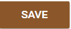
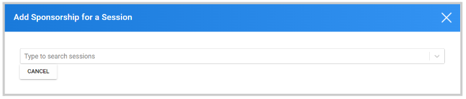

import { shareArticle } from '../../../components/share.js';
import { FaLink } from 'react-icons/fa';
import { ToastContainer, toast } from 'react-toastify';
import 'react-toastify/dist/ReactToastify.css';

export const ClickableTitle = ({ children }) => (
    <h1 style={{ display: 'flex', alignItems: 'center', cursor: 'pointer' }} onClick={() => shareArticle()}>
        {children} 
        <FaLink size="0.6em" />
    </h1>
);

<ToastContainer />

<ClickableTitle>Create Company</ClickableTitle>

For Exhibitors or Sponsors, you can create their own profile for the specific event.

1. Go to **Events**, and select the event tile 

2. From the left panel, click **Companies** 

3. Click **Create Company** 

4. In the pop-up window, set the name, email to receive all communications for this company, and select if this company is Exhibitor, Sponsor, or both. 

**Note:** the email address used here, will be the main contact linked to the company contact section, including the **Contact Me** function that allows attendees/speakers to leave their email addresses to be contacted

5. Click **Save**

Once you have created the company, you can complete and personalize its profile. 

## Company Information

This tab will allow you to update the following information:

* Tagline: Is a short, memorable phrase used in marketing campaigns to convey the value of a brand or its products.
* Website: You can include here the company's website URL
* Logo: Company logo to display on their page. Best dimensions 100px x 100px, best to use transparent background png. Images will be resized to contain
* Directory Image: Image to display in the company's profile. Best dimensions 400px x 400px. Images will be resized to cover.
* Link: Exhibitor/Sponsor URL to display the link below the About section.
* Link Title: The title they would like to provide to the link
* Categories: Set a previously created category. For more information on how to create them, go [here](https://docs-for-customers.slayte.com/hc/en-us/articles/12879220427155)
* Description: Short description about the company to be displayed in the "About" section
* Social Links: Any social media links related to the company (Facebook, Twitter, Linkedin, Youtube, Vimeo, and others)
* Additional Page Call to Action: Will enable an additional button to redirect to a specific site
* Documents: Any document to be included in their profile

## Company Site

Here, you can edit their site description, preview the site or make the site visible or hidden for attendees. 

## Company Team

Companies can decide to either enable/ disable the **Chat** function for their members/representatives to interact with the attendees. You can google ON/OFF to make the changes 

Here, you can also set up a **Company Representative Emails,**as the main contact. 

## Reports

You will have access to different reports for Visitors, Leads, Downloads, Chats. To download any of these reports: 

1. Click Download Report at the bottom of the page

2. And select the type of report you want

## Advertisements

For a better visibility, you can create Ads for Exhibitors/Sponsors here, to be displayed either in sessions, overview, or the navigation section. 

1. From the **Advertisement** tab, click **Create Ad**

****

2. On the pop-up window, set the **name** and **type** (Session, Overview, Navigation, then click **Create Ad**

## mceclip9.png

3. Once you have created the Ad, you will be able to edit the image

4. Click **Save**

From the Ads list, you will be able to edit or delete if no longer needed 

You can also manage all Ads, after created here from the main Sponsorship tab, for more information go [here](https://docs-for-customers.slayte.com/hc/en-us/articles/12874457438611)

## Sponsored sessions

You can add **Sponsorship** for a specific session. 

1. Click **Add Session Sponsorship**

****

2. Search for the session name

3. Then you are required to select a previously created **Ad**, set if it is **Exclusive** or not, and add any **video Links** available. 

4. Click **Save**

From the sponsored sessions list, you can preview their exclusive and view setup; Edit or delete if no longer needed 

