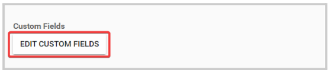
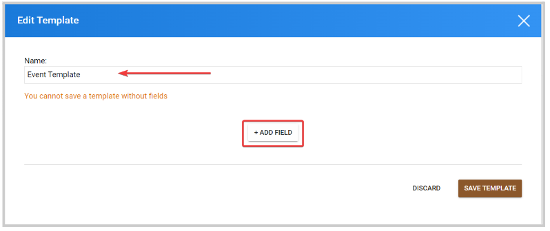
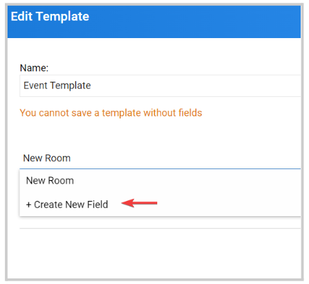
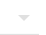
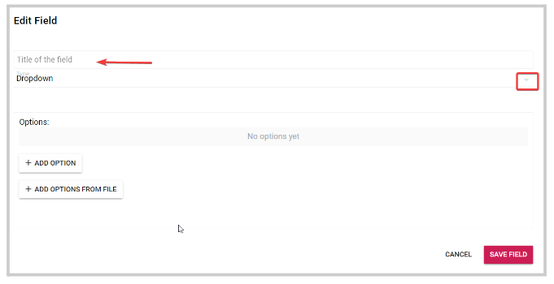
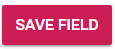
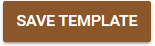

import React from 'react';
import { shareArticle } from '../../share.js';
import { FaLink } from 'react-icons/fa';
import { ToastContainer, toast } from 'react-toastify';
import 'react-toastify/dist/ReactToastify.css';

export const ClickableTitle = ({ children }) => (
    <h1 style={{ display: 'flex', alignItems: 'center', cursor: 'pointer' }} onClick={() => shareArticle()}>
        {children} 
        <FaLink size="0.6em" />
    </h1>
);

<ToastContainer />

<ClickableTitle>Create Custom Fields</ClickableTitle>

You can create additional fields to personalize your session details to include additional information related to that specific event. 

1. From the Home page, click **Events** from the home menu or from the left panel

2. Click the tile for the desired event

3. From the menu to the left, click the **General** tab

4. In the Custom Fields section, click **Edit Custom Fields**

5. On the pop-up window, you will be required to set a template name and click **Add Field** to start creating. 

6.  **Search** by name previously created custom fields or select **Create New Field** from the drop-down menu

7. In the **Title of the field,** type in the name of the field to be displayed

8. Select a **field type **

Your fields choices include:

* Dropdown
* Text (Single line)
* Text Area (Multiple lines)
* User Search
* Attachment
* Page Break
* Autocomplete
* Radio Group
* Check boxes
* Yes/No
* Computer Information
* Slider
* Date of Birth
* Date Picker
* Date Time Picker
* Date Range Selection
* Static Text
* Static Attachment
* Media Link
* Virtual Meeting
* Categories
* People

9. When finished, select **SAVE FIELD**

10. Either repeat the above steps to create additional custom fields or select **SAVE TEMPLATE**

/*/*Please note, if planning on exporting to AMS ensure that the administrator has created a custom field for Session Code.

