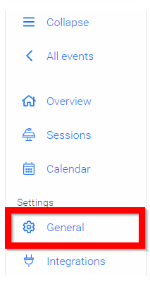
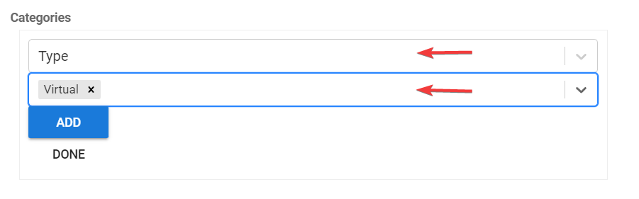
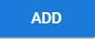

import React from 'react';
import { shareArticle } from '../../share.js';
import { FaLink } from 'react-icons/fa';
import { ToastContainer, toast } from 'react-toastify';
import 'react-toastify/dist/ReactToastify.css';

export const ClickableTitle = ({ children }) => (
    <h1 style={{ display: 'flex', alignItems: 'center', cursor: 'pointer' }} onClick={() => shareArticle()}>
        {children} 
        <FaLink size="0.6em" />
    </h1>
);

<ToastContainer />

<ClickableTitle>Create Session Categories</ClickableTitle>

Filtering is a handy feature that allows you and the targeted audience to search for specific Sessions using the search criteria of your choice. The search criteria will need to be linked to a specific **Field** you have added to your **Template** (e.g. Track).

1. From the Home page, select **Events** from the tile or from the left pane

2. Select the desired event

3. Click **General** from the left pane

3. Select **EDIT SESSION CATEGORIES**

****

4. Click in the field then **type** the name to add a new category then press **enter**

5. On the newly created category, click on **Edit** next to it, to add values to the category as well as to configure the category color

/*/*Examples of custom fields to create but not limited to Session Type, Session Format, Track./*/*

6. Optional - Select **Color sessions based on this category** by clicking the color box.

7. When finished, click the **SAVE CHANGES TO SESSION FORMAT** button.

 

Once created, you can assign these **categories** to existing sessions individually or in bulk.

## **Single session**

1. From the **Sessions list** view, locate and click on the session you would like to modify to display the **Session Details**  
2. Locate the **Category** section, and click **Edit**

  
3. From the drop-down menu, select first the **Category** and then the **Category Value**

  
4. Click **Add**

  
5. Click **Save**at the bottom 

## **Multiple Sessions**

1. From the **Sessions list** view, click the **checkbox** to the left to select **some or all the sessions** to update

2. Once selected, the **Edit** button will be enabled at the top

  
3. In the **Property to Update** field, from the drop-down menu select **Categories**

   
4. In the **Categories** field, click Edit then select the **C****ategory** and its **value**

  
5. Click **Add**

   
6. Once added, select the **action to take**: 

* **Replace with the above:** will remove any existing categories and replace them with the above
* **Add the above to list:** any existing category will remain the same, and the session will be updated with the new categories selected above
* **Remove the above from list:** whenever you would like to instead remove a category, this will only remove the selected category above

7. Once ready, click **Update**

****

8. You will receive the following confirmation once successfully updated

