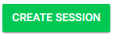
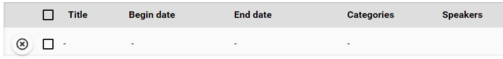
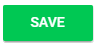

import { shareArticle } from '../../../components/share.js';
import { FaLink } from 'react-icons/fa';
import { ToastContainer, toast } from 'react-toastify';
import 'react-toastify/dist/ReactToastify.css';

export const ClickableTitle = ({ children }) => (
    <h1 style={{ display: 'flex', alignItems: 'center', cursor: 'pointer' }} onClick={() => shareArticle()}>
        {children} 
        <FaLink size="0.6em" />
    </h1>
);

<ToastContainer />

<ClickableTitle>Create a Session</ClickableTitle>

1. From the desired event navigate to **Sessions**

2. Select the **Create Session** button

3. A new submission will appear at the top of the session list as blank

4. **Click** on the line item to open the Session Detail to edit the details/contents of the session

* Title
* Add previously created Categories
* Session Description
* Attachments
* Session Type
* Begin date/ End date
* Speakers
* Virtual - Add Stream / Video / Conference
* Attendance - Mark attended above threshold (duration)
* Fill in previously created custom fields

5. Select **SAVE** when ready

