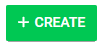

import { shareArticle } from '../../../components/share.js';
import { FaLink } from 'react-icons/fa';
import { ToastContainer, toast } from 'react-toastify';
import 'react-toastify/dist/ReactToastify.css';

export const ClickableTitle = ({ children }) => (
    <h1 style={{ display: 'flex', alignItems: 'center', cursor: 'pointer' }} onClick={() => shareArticle()}>
        {children} 
        <FaLink size="0.6em" />
    </h1>
);

<ToastContainer />

<ClickableTitle>Create a Title and Sub Title</ClickableTitle>

1. From the Home page select **Events** from the tile or from the left pane

2. Select the **Create** button

3. Select **General** to access event settings and to officially begin customizing

3. Highlight over the default event **title** then type over the highlighted text

4. Type in **Sub title**

Please note, many administrators add in specific details that will provide attendees with more information about the conference such as*Keynote Speakers*, *Venue Directions* and much more.

5. Select **SAVE** to complete changes

