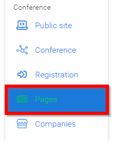
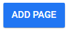
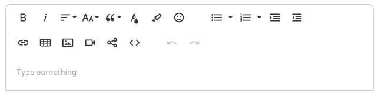
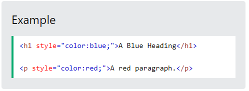
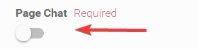
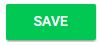
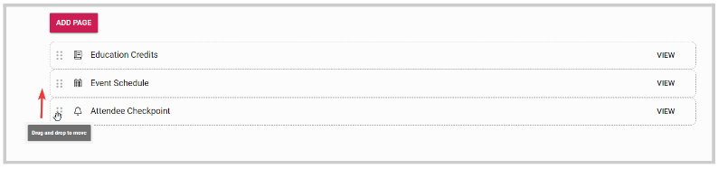

import React from 'react';
import { shareArticle } from '../../share.js';
import { FaLink } from 'react-icons/fa';
import { ToastContainer, toast } from 'react-toastify';
import 'react-toastify/dist/ReactToastify.css';

export const ClickableTitle = ({ children }) => (
    <h1 style={{ display: 'flex', alignItems: 'center', cursor: 'pointer' }} onClick={() => shareArticle()}>
        {children} 
        <FaLink size="0.6em" />
    </h1>
);

<ToastContainer />

<ClickableTitle>Create and Customize Page(s)</ClickableTitle>

In Slayte, you can create pages for your event. You can customize page content, and settings, and optimize pages for your attendees.

     Recommended but not required pages:

* + Awards
	+ Floor Plan
	+ Meet the Team
	+ Past Conference
	+ Resources
	+ Travel/Destination Information
	+ Q&A

1. Navigate to the desired event

2. Click **Pages**

3. Select **ADD PAGE**

4. In the Name field, type in the display **Title** and set the **Icon** from the drop-down menu that will identify the page

5. Select the **Type of Page**

* **Display content -** Create or modify with HTML/CSS/WYSWYG

**WYSIWYG** is a type of editing software that allows users to see and edit content in a form that appears as it would when displayed on an interface, webpage, slide presentation, or printed document. 

Optional, Enable **Code Editor** to open **Code (HTML/CSS)**

Code HTML, element displays its contents styled in a fashion intended to indicate that the text is a short fragment of computer code. B

CSS, allows control of the color, font, size of text, the spacing between elements, how elements are positioned and laid out, what background images or background colors are to be used, different displays for different devices and screen sizes, and much more!

* **Link to external website -** Provide a link to where redirection will take the targeted audience

6. You can also enable/ disable a **Chat** function for your page 

7. Select **SAVE** when ready

/*/*Please note, if you have opted for registrants, only completed registrants will have access to *Pages*.

When you navigate **back to the list of pages** as an Administrator, you will be provided with the list of previously created Pages. From here you will be able to re-arrange the order of the pages by dragging and dropping them 

