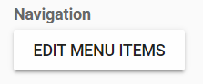
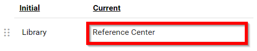
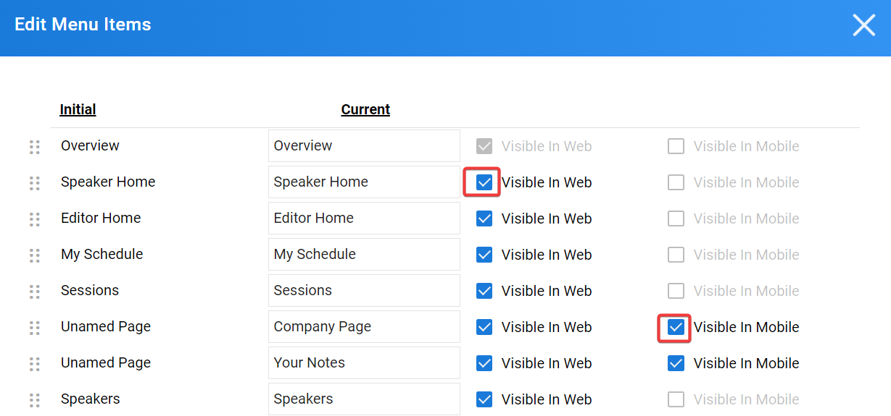
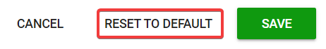

import React from 'react';
import { shareArticle } from '../../share.js';
import { FaLink } from 'react-icons/fa';
import { ToastContainer, toast } from 'react-toastify';
import 'react-toastify/dist/ReactToastify.css';

export const ClickableTitle = ({ children }) => (
    <h1 style={{ display: 'flex', alignItems: 'center', cursor: 'pointer' }} onClick={() => shareArticle()}>
        {children} 
        <FaLink size="0.6em" />
    </h1>
);

<ToastContainer />

<ClickableTitle>Customize Navigation Bar</ClickableTitle>

1. From the Home page, select **Events** from the tile or from the left pane

2. Select the desired event

3. Select **General** 

4. Select **EDIT MENU ITEMS** in the Navigation section

5a. **To move the menu items**: Select the **enigmatic ellipsis** of the menu option you wish to arrange, then drop for desired placement

5b. **To re-label menu items:** Click in the **Current** field, then **type** in the desired label

5c. You can also decide whether to make the field **visible** or not in the **Web** or **mobile** version of your event by clicking the checkbox to the right of each field

**NOTE:** Currently, the Mobile configuration is only available for custom fields

5d. **To reset menu items**: Select **RESET TO DEFAULT**

6. Select **SAVE** to complete changes

