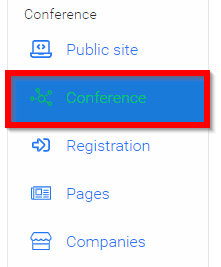
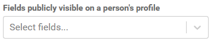

import { shareArticle } from '../../../components/share.js';
import { FaLink } from 'react-icons/fa';
import { ToastContainer, toast } from 'react-toastify';
import 'react-toastify/dist/ReactToastify.css';

export const ClickableTitle = ({ children }) => (
    <h1 style={{ display: 'flex', alignItems: 'center', cursor: 'pointer' }} onClick={() => shareArticle()}>
        {children} 
        <FaLink size="0.6em" />
    </h1>
);

<ToastContainer />

<ClickableTitle>Customize Profile Fields Conference</ClickableTitle>

1. Navigate to Events > *Desired Event* > **Conference**

2. Scroll down to the section **People** then click inside the **drop down menu** to select the previously created profile field(s) to be publicly visible on a persons profile

3. Select **SAVE EVENT** when finished making desired changes

