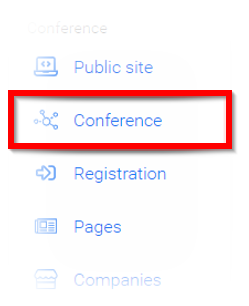
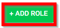
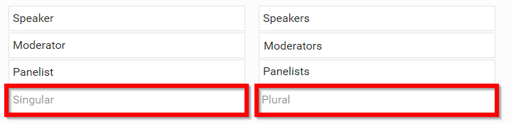
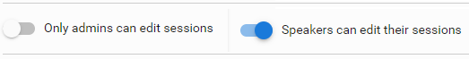
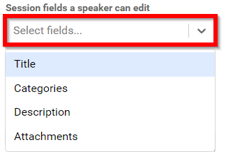
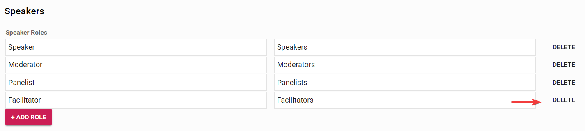

import { shareArticle } from '../../../components/share.js';
import { FaLink } from 'react-icons/fa';
import { ToastContainer, toast } from 'react-toastify';
import 'react-toastify/dist/ReactToastify.css';

export const ClickableTitle = ({ children }) => (
    <h1 style={{ display: 'flex', alignItems: 'center', cursor: 'pointer' }} onClick={() => shareArticle()}>
        {children} 
        <FaLink size="0.6em" />
    </h1>
);

<ToastContainer />

<ClickableTitle>Defining Conference Speaker Types/Roles</ClickableTitle>

1. Navigate to the desired **Conference**

2. Select **Conference** from the menu 

3. Navigate to the **Speakers section** of the page

4. To add a role select **ADD ROLE** 

5. Enter in the value for singular and plural speaker role

6. Set the tone for allowing editing sessions by sliding the indicator from **Only admins can edit sessions** to Speakers can edit their sessions

7. In the Session fields a speaker can edit, click in **Select fields** bracket to open the drop-down menu of options 

/*/*Please note, you can select one or more options.

8. Select **SAVE EVENT** when finished

9. If a Speaker type/ Role is no longer needed, from the list you can click **Delete**to be immediately removed 

10. Then click **Save Event** at the bottom of the page

