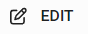

import React from 'react';
import { shareArticle } from '../../share.js';
import { FaLink } from 'react-icons/fa';
import { ToastContainer, toast } from 'react-toastify';
import 'react-toastify/dist/ReactToastify.css';

export const ClickableTitle = ({ children }) => (
    <h1 style={{ display: 'flex', alignItems: 'center', cursor: 'pointer' }} onClick={() => shareArticle()}>
        {children} 
        <FaLink size="0.6em" />
    </h1>
);

<ToastContainer />

<ClickableTitle>Delete Event Integration</ClickableTitle>

1. Go to the desired event

2. To the left under Settings, click **Integrations**

3. Click Edit next to the event name 

4. Scroll down to the bottom of the page, and click Delete Integration 

5. You'll be automatically routed to the main Integrations page and receive a confirmation on the top as follows

 

