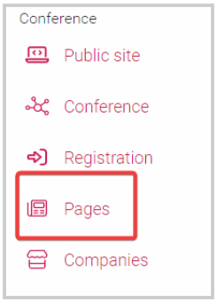
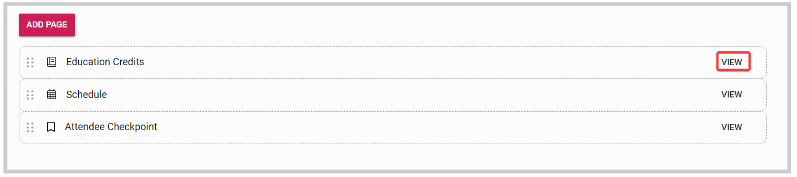
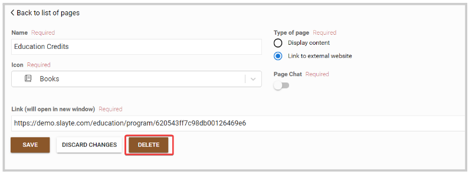
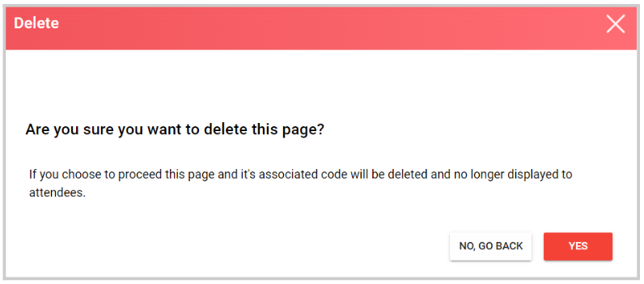
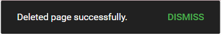

import { shareArticle } from '../../../components/share.js';
import { FaLink } from 'react-icons/fa';
import { ToastContainer, toast } from 'react-toastify';
import 'react-toastify/dist/ReactToastify.css';

export const ClickableTitle = ({ children }) => (
    <h1 style={{ display: 'flex', alignItems: 'center', cursor: 'pointer' }} onClick={() => shareArticle()}>
        {children} 
        <FaLink size="0.6em" />
    </h1>
);

<ToastContainer />

<ClickableTitle>Delete Page</ClickableTitle>

1. Go to Events, and select the desired event 

2. From the left panel, click **Pages**

****

3. Next to the page you want to delete, click **View** 

4. From the page settings, click **Delete**

5. From the confirmation page, click **Yes** to proceed 

6. You will be routed to the main Page menu and the following pop-up confirmation message will appear 

