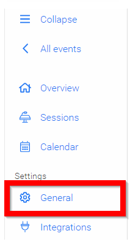
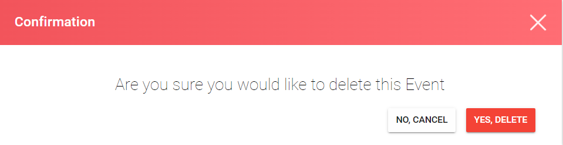

import React from 'react';
import { shareArticle } from '../../share.js';
import { FaLink } from 'react-icons/fa';
import { ToastContainer, toast } from 'react-toastify';
import 'react-toastify/dist/ReactToastify.css';

export const ClickableTitle = ({ children }) => (
    <h1 style={{ display: 'flex', alignItems: 'center', cursor: 'pointer' }} onClick={() => shareArticle()}>
        {children} 
        <FaLink size="0.6em" />
    </h1>
);

<ToastContainer />

<ClickableTitle>Delete an Event</ClickableTitle>

1. From the Home page select **Events** from the tile or from the left pane

2. Select the desired event

3. Select **General** 

4. Scroll all the way to the bottom of the page, then click **Delete Event**

****

5. From the confirmation window, click **Yes, Delete**

6. You will be redirected to the **Events** page

