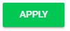

import React from 'react';
import { shareArticle } from '../../share.js';
import { FaLink } from 'react-icons/fa';
import { ToastContainer, toast } from 'react-toastify';
import 'react-toastify/dist/ReactToastify.css';

export const ClickableTitle = ({ children }) => (
    <h1 style={{ display: 'flex', alignItems: 'center', cursor: 'pointer' }} onClick={() => shareArticle()}>
        {children} 
        <FaLink size="0.6em" />
    </h1>
);

<ToastContainer />

<ClickableTitle>Edit Session Column(s)</ClickableTitle>

1. From the desired event navigate to **Sessions**

2. Select the **Edit Columns** icon

3. In the **Edit Columns** modal you will be able to complete the following:

* Search and filter by fields
* Select what columns will be displayed in the table by selecting the blue checkmark in the Columns
* In the Selected Columns you can drag and drop to arrange order

4. Select **APPLY** to save changes

