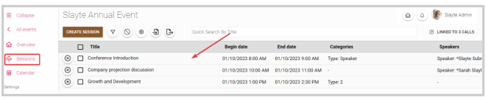
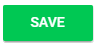
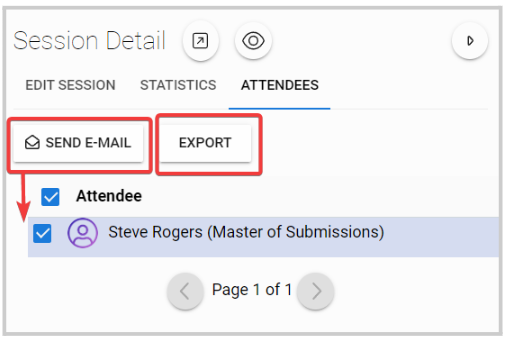
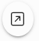

import React from 'react';
import { shareArticle } from '../../share.js';
import { FaLink } from 'react-icons/fa';
import { ToastContainer, toast } from 'react-toastify';
import 'react-toastify/dist/ReactToastify.css';

export const ClickableTitle = ({ children }) => (
    <h1 style={{ display: 'flex', alignItems: 'center', cursor: 'pointer' }} onClick={() => shareArticle()}>
        {children} 
        <FaLink size="0.6em" />
    </h1>
);

<ToastContainer />

<ClickableTitle>Edit Session Details</ClickableTitle>

Now that you have created an Event and added a few Sessions to it, you may want to Add or Remove a few more sessions or make changes to the sessions you have already scheduled. Making changes to previously created Sessions may be handy for any last-minute adjustments to your event schedule.

1. From the desired event, navigate to the **Sessions**tab on the left 

2. Click on the line item to open the Session Detail tab on the right side, to edit the details/contents of the session

From the Session Details tab, you will be able to edit the following:

* Title
* Add or remove previously created Categories
* Session Description
* Add Attachments. Note the allowed attachment types are:  Images, Animations, Videos, Audios, Microsoft Word, Microsoft Excel, PDF, Presentations, Text File.
* Session Type: Standard, Poster, or Panel
* Begin date/ End date
* Speakers. Here you can also assign the different speaker roles previously created in the event settings (Conference tab)
* Virtual - Add Stream / Video / Conference
* Attendance - Mark attended above threshold (duration)
* Fill in previously created custom fields. For more information on Custom fields, go [here](https://docs-for-customers.slayte.com/hc/en-us/articles/4413826527635)

3. Select **SAVE** when ready

From the Session Details tab, you also have access to the following session information:

* Statistics: where will show the number of enrolled attendees for the specific session.
* Attendees: will display the list of enrolled attendees. From here you can also, **send emails** to some or all attendees and **Export** them.

* Link a specific submission to a session 
* Preview session as attendee 

