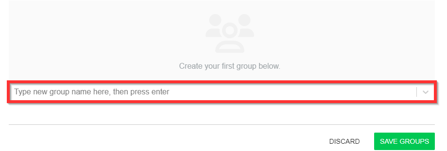
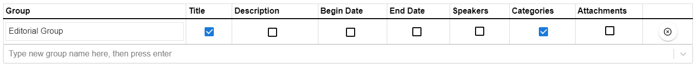
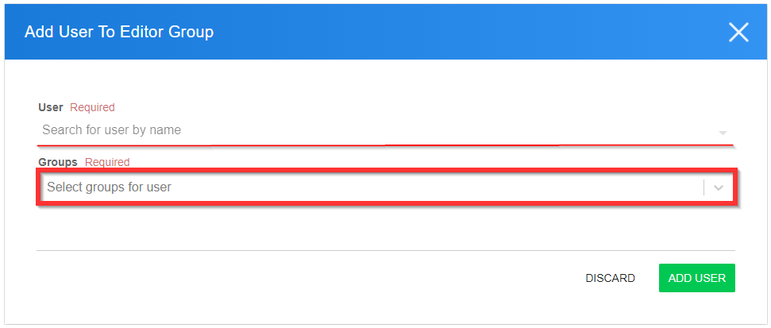
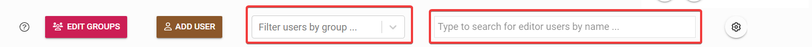
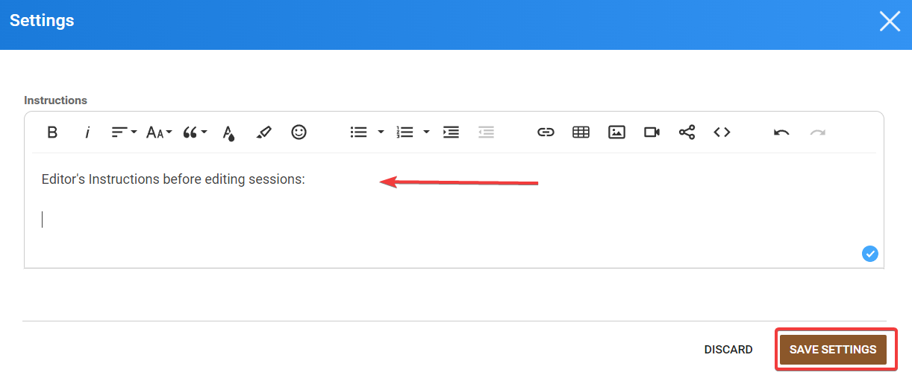
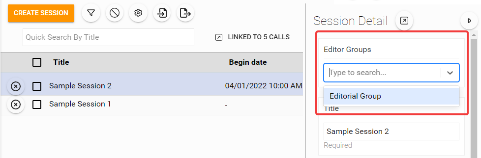

import { shareArticle } from '../../../components/share.js';
import { FaLink } from 'react-icons/fa';
import { ToastContainer, toast } from 'react-toastify';
import 'react-toastify/dist/ReactToastify.css';

export const ClickableTitle = ({ children }) => (
    <h1 style={{ display: 'flex', alignItems: 'center', cursor: 'pointer' }} onClick={() => shareArticle()}>
        {children} 
        <FaLink size="0.6em" />
    </h1>
);

<ToastContainer />

<ClickableTitle>Editors Groups</ClickableTitle>

Editor Groups allow the Administrator to relegate to any non-administrator user, role permissions to edit session details on any designated sessions that have been specified to said group.

The Editor Groups are event specific and can be accessed from within the desired event. You can set it up by following these steps:

1. Select the desired Event, then select **Editors** from the left panel navigation bar

2. Select **Edit Groups**

3. Create your first group by typing the name in the field, then select **Enter**

4. Select the **SAVE GROUPS** button when ready

5. Select the desired session field(s) the group will have access to modify

**

*Please note, this can also include any custom fields that have been created for the event.*

6. Click **SAVE GROUPS**

7. After creating the group(s) select the **ADD USER** button to designate a permission group for the user and group select **ADD USER** when ready

From the main Editors Group page, you can now filter by group or editor user by name

You can also include any specific instructions for the Editors to review before editing their sessions. To do so, click the Settings button on the right-top corner and start writing your message. When ready, click **Save Settings.**

Now you will be able to designate which session(s) are assigned to a group. There are two ways to accomplish this:

1. Within the desired **Session Detail** you can specify which Editor Group the session is assigned to

2. Bulk assign the **Editor Group** to multiple sessions 

1. After selecting two or more sessions, click  to edit the session details in bulk
2. You will be redirected to Bulk Edit from the Property to update field select **Editor Groups** followed by selecting desired Editor Groups
3. Select **Update** to complete the changes

If the administrator wishes to remove a permission that has been granted to the user, it can be done by selecting **Editors** from the navigation bar then removing the permission group(s) next to the user.

Please note, there is no limit to the number of groups or individuals within those groups.

